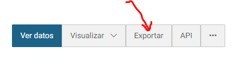
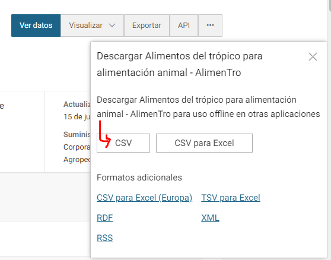

```{r setup, include=FALSE}
knitr::opts_chunk$set(echo = TRUE, warning = FALSE, message = FALSE)
```

# Actividad

- **Ponderación de actividad 01:** 40% de la nota final.
- **Fecha máxima de entrega:** lunes 23 de octubre de 2023.
- **Desarrollo de actividad:** la actividad se desarrollará de forma individual.
- **Entregables:**
  - Tablero de datos en formato HTML construido con la biblioteca [flexdashboard.](https://pkgs.rstudio.com/flexdashboard/) **Nota:** no debe incluir códigos de R en este documento.
  - Documento corto (máximo 3 páginas) en formato pdf o word donde se explicará de forma suscinta el anáisis desarrollado. La idea es que en este documento se describa brevemente la base de datos utilizada, las tablas, métricas o gráficos usados para la construcción del tablero de datos, la interpretación de los resultados de mayor relevancia y sus conclusiones. **Nota:** no debe incluir códigos de R en este documento.
  - Archivo de excel con el diagnóstico de las bases de datos.

# Descripción general

La actividad de *estadística descriptiva y exploratoria* tiene tres objetivos principales:

- Diagnóstico de bases de datos desordenadas y planteamiento de soluciones a los problemas detectados.
- Narrativa de datos (*storytelling*) haciendo uso de métodos estadísticos descriptivos.
- Construcción de tableros de datos para comunicación de resultados.

# Diagnóstico de bases de datos desordenadas

La siguiente es una lista de bases de datos abiertas del gobierno de Colombia, relacionadas con el *Ministerio de Agricultura*. Su tarea en este punto es diagnosticar si la base de datos es "ordenada" o "desordenada". Si es "desordenada" deberá indicar por qué lo es y cuáles son los criterios o principios que incumple para ser considerada de esta forma, por el contrario, si es "ordenada" basta que indique que lo es. El archivo de excel contiene la [plantilla]() que deberá entregar con el diagnóstico requerido.

- [01: Asistencia técnica agropecuaria Palmira](https://www.datos.gov.co/Agricultura-y-Desarrollo-Rural/Asistencia-t-cnica-agropecuaria-Palmira/6rr4-a8f6)
- [02: Consolidado agrícola por municipios de los cultivos permanentes del Valle del Cauca](https://www.datos.gov.co/Agricultura-y-Desarrollo-Rural/Consolidado-agr-cola-por-municipios-de-los-cultivo/exfh-span)
- [03: Consolidado agrícola por municipios de los cultivos transitorios del Valle del Cauca](https://www.datos.gov.co/Agricultura-y-Desarrollo-Rural/Consolidado-agr-cola-por-municipios-de-los-cultivo/eapn-82ui)
- [04: Ganaderos beneficiarios de capacitación e inseminación por el programa del ADR (agencia de desarrollo rural) y la Gobernación](https://www.datos.gov.co/Agricultura-y-Desarrollo-Rural/Ganaderos-beneficiarios-de-capacitaci-n-e-insemina/qjcw-5iwb)
- [05: Índice de precios de insumos agrícolas](https://www.datos.gov.co/Agricultura-y-Desarrollo-Rural/-ndice-de-precios-de-insumos-agr-colas/gwbi-fnzs)
- [06: Base de datos relacionada con madera movilizada proveniente de Plantaciones Forestales Comerciales](https://www.datos.gov.co/Agricultura-y-Desarrollo-Rural/Base-de-datos-relacionada-con-madera-movilizada-pr/9aan-wm8m)
- [07: Base de datos relacionada con área plantada con Plantaciones Forestales Comerciales](https://www.datos.gov.co/Agricultura-y-Desarrollo-Rural/Base-de-datos-relacionada-con-rea-plantada-con-Pla/h3uz-jvkj)
- [08: Exportaciones agrícolas no tradicionales y tradicionales](https://www.datos.gov.co/Agricultura-y-Desarrollo-Rural/Exportaciones-agr-colas-no-tradicionales-y-tradici/h7mi-sbxb)
- [09: Sacrificio de Porcinos de Yopal](https://www.datos.gov.co/Agricultura-y-Desarrollo-Rural/Sacrificio-de-Porcinos-de-Yopal/wmwp-7etn)
- [10: Sacrificio de Bovino de Yopal](https://www.datos.gov.co/Agricultura-y-Desarrollo-Rural/Sacrificio-de-Bovino-de-Yopal/3rgr-3eua)
- [11: Inventario anual de Bovinos en Antioquia desde 2000](https://www.datos.gov.co/Agricultura-y-Desarrollo-Rural/Inventario-anual-de-Bovinos-en-Antioquia-desde-200/fy9z-8zxt)
- [12: Distribución de la superficie en pastos con utilización ganadera](https://www.datos.gov.co/Agricultura-y-Desarrollo-Rural/Distribuci-n-de-la-superficie-en-pastos-con-utiliz/i4zs-39hz)
- [13: Alimentos del trópico para alimentación animal - AlimenTro](https://www.datos.gov.co/Agricultura-y-Desarrollo-Rural/Alimentos-del-tr-pico-para-alimentaci-n-animal-Ali/6arb-d547)

La siguiente imagen muestra la plantilla que deberá diligenciar y entregar para el diagnóstico de datos "ordenados" y "desordenados". Las columnas de esta plantilla se describen a continuación:

- **Base de datos:** base de datos para diagnóstico.
- **Tipo:** columna que deberá diligenciar con las opciones "Ordenada" o "Desordenada".
- **Diagnóstico:** columna en la que deberá describir brevemente por qué la base de datos es "desordenada" y cuáles son los principios que incumple. Recuerde que si su diagnóstico es "Ordenada" no deberá agregar ninguna descripción.
- **Selección:** marque con una "X" la base de datos seleccionada para el *storytelling* y la construcción del tablero de datos. Sólo debe elegir una base de datos.


# Storytelling

En este punto habrá seleccionado una base de datos de las 13 listadas anteriormente. Deberá hacer uso de métodos estadísticos descriptivos como tablas, métricas y gráficos para narrar la historia que compete a su base de datos. Es muy importante que identifique cuál es el individuo bajo estudio y si hay alguna acotación en espacio y/o tiempo. Profundice lo suficiente en el análisis descriptivo para que pueda elegir los resultados que desea incluir en su tablero de datos. El entregable de este apartado es el documento en pdf o word de máximo 3 páginas. **NO SE CALIFICARÁN CÓDIGOS DE R**.

Es importante mencionar que las bases de datos pueden tener inconsistencias, errores o problemas (no necesariamente relacionados con datos ordenados o desordenados) que deberá identificar y solucionar para proceder con su análisis. Por ejemplo, en algunas bases de datos hay columnas que serán importadas a R como "character" cuando en realidad son "numeric", este tipo de inconsistencias deberán ser identificadas y corregidas.

# Tablero de datos

En este punto deberá haber elegido una base de datos de las 13 listadas anteriormente y ya habrá desarrollado su análisis descriptivo y exploratorio, se recomienda que elija los resultados (métricas, tablas o gráficos) de mayor relevancia para lo que desea comunicar en el tablero de datos.

# Recursos de información

- [¿Qué es Data Storytelling?](https://datademia.es/blog/que-es-data-storytelling)
- [What is data storytelling?](https://powerbi.microsoft.com/en-us/data-storytelling/)
- [https://www.iebschool.com/blog/data-storytelling-que-es-big-data/](https://www.iebschool.com/blog/data-storytelling-que-es-big-data/)
- [What is a data dashboard?](https://powerbi.microsoft.com/en-us/data-dashboards/)
- [Colores en R](https://r-charts.com/colors/)
- [Colores hexadecimal - W3Schools](https://www.w3schools.com/colors/colors_hexadecimal.asp)
- [Ejemplos de tableros de datos con R](https://rstudio.github.io/flexdashboard/articles/examples.html)

# Anexo: descarga de datos

1. Ingrese al hipervínculo de la base de datos de interés.
2. En la parte superior derecha de la página web dar clic en "Exportar":



3. Dar clic en la opción "CSV" para descargar:

