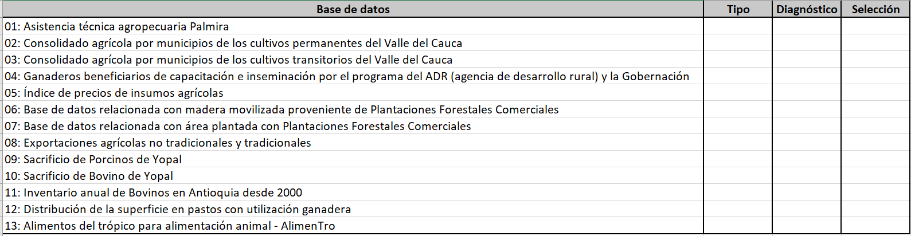

```{r setup, include=FALSE}
knitr::opts_chunk$set(echo = TRUE, warning = FALSE, message = FALSE)
```

# Actividad

- **Fecha máxima de entrega:** viernes 12 de abril de 2024.
- **Desarrollo de actividad:** la actividad se desarrollará de forma individual.

# Diagnóstico de bases de datos desordenadas

La siguiente es una lista de bases de datos abiertas del gobierno de Colombia, relacionadas con el *Ministerio de Agricultura*. Su tarea en este punto es diagnosticar si la base de datos es "ordenada" o "desordenada". Si es "desordenada" deberá indicar por qué lo es y cuáles son los criterios o principios que incumple para ser considerada de esta forma, por el contrario, si es "ordenada" basta que indique que lo es. El archivo de excel contiene la [plantilla](Plantilla-Datos.xlsx) que deberá entregar con el diagnóstico requerido.

- [01: Asistencia técnica agropecuaria Palmira](https://www.datos.gov.co/Agricultura-y-Desarrollo-Rural/Asistencia-t-cnica-agropecuaria-Palmira/6rr4-a8f6)
- [02: Consolidado agrícola por municipios de los cultivos permanentes del Valle del Cauca](https://www.datos.gov.co/Agricultura-y-Desarrollo-Rural/Consolidado-agr-cola-por-municipios-de-los-cultivo/exfh-span)
- [03: Consolidado agrícola por municipios de los cultivos transitorios del Valle del Cauca](https://www.datos.gov.co/Agricultura-y-Desarrollo-Rural/Consolidado-agr-cola-por-municipios-de-los-cultivo/eapn-82ui)
- [04: Ganaderos beneficiarios de capacitación e inseminación por el programa del ADR (agencia de desarrollo rural) y la Gobernación](https://www.datos.gov.co/Agricultura-y-Desarrollo-Rural/Ganaderos-beneficiarios-de-capacitaci-n-e-insemina/qjcw-5iwb)
- [05: Índice de precios de insumos agrícolas](https://www.datos.gov.co/Agricultura-y-Desarrollo-Rural/-ndice-de-precios-de-insumos-agr-colas/gwbi-fnzs)
- [06: Base de datos relacionada con madera movilizada proveniente de Plantaciones Forestales Comerciales](https://www.datos.gov.co/Agricultura-y-Desarrollo-Rural/Base-de-datos-relacionada-con-madera-movilizada-pr/9aan-wm8m)
- [07: Base de datos relacionada con área plantada con Plantaciones Forestales Comerciales](https://www.datos.gov.co/Agricultura-y-Desarrollo-Rural/Base-de-datos-relacionada-con-rea-plantada-con-Pla/h3uz-jvkj)
- [08: Exportaciones agrícolas no tradicionales y tradicionales](https://www.datos.gov.co/Agricultura-y-Desarrollo-Rural/Exportaciones-agr-colas-no-tradicionales-y-tradici/h7mi-sbxb)
- [09: Sacrificio de Porcinos de Yopal](https://www.datos.gov.co/Agricultura-y-Desarrollo-Rural/Sacrificio-de-Porcinos-de-Yopal/wmwp-7etn)
- [10: Sacrificio de Bovino de Yopal](https://www.datos.gov.co/Agricultura-y-Desarrollo-Rural/Sacrificio-de-Bovino-de-Yopal/3rgr-3eua)
- [11: Inventario anual de Bovinos en Antioquia desde 2000](https://www.datos.gov.co/Agricultura-y-Desarrollo-Rural/Inventario-anual-de-Bovinos-en-Antioquia-desde-200/fy9z-8zxt)
- [12: Distribución de la superficie en pastos con utilización ganadera](https://www.datos.gov.co/Agricultura-y-Desarrollo-Rural/Distribuci-n-de-la-superficie-en-pastos-con-utiliz/i4zs-39hz)
- [13: Alimentos del trópico para alimentación animal - AlimenTro](https://www.datos.gov.co/Agricultura-y-Desarrollo-Rural/Alimentos-del-tr-pico-para-alimentaci-n-animal-Ali/6arb-d547)

La siguiente imagen muestra la plantilla que deberá diligenciar y entregar para el diagnóstico de datos "ordenados" y "desordenados". Las columnas de esta plantilla se describen a continuación:

- **Base de datos:** base de datos para diagnóstico.
- **Tipo:** columna que deberá diligenciar con las opciones "Ordenada" o "Desordenada".
- **Diagnóstico:** columna en la que deberá describir brevemente por qué la base de datos es "desordenada" y cuáles son los principios que incumple. Recuerde que si su diagnóstico es "Ordenada" no deberá agregar ninguna descripción.




# Anexo: descarga de datos

1. Ingrese al hipervínculo de la base de datos de interés.
2. En la parte superior derecha de la página web dar clic en "Exportar":


3. Dar clic en la opción "CSV" para descargar:

