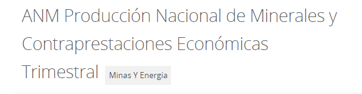

```{r setup, include=FALSE}
knitr::opts_chunk$set(echo = TRUE)
```

# Actividad

- Elija una base de datos sobre la cual desee realizar el análisis estadístico de tipo descriptivo y exploratorio:
  - [Producción de oro y plata en Colombia años 2012 a 2020.](/actividades/Statistics/Actividad-01/oro_plata.csv)

# Bases de datos

## Minería en colombia años 2012 a 2020

<center>

</center> 

- La base de datos completa puede ser consultada [aquí.](https://www.datos.gov.co/Minas-y-Energ-a/ANM-Producci-n-Nacional-de-Minerales-y-Contraprest/r85m-vv6c)
