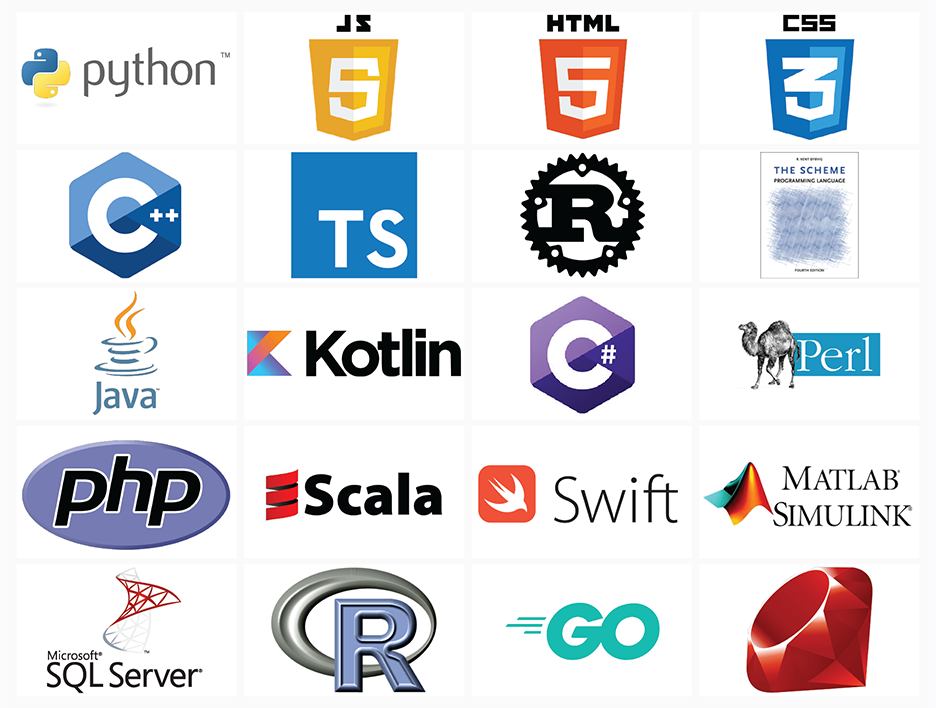
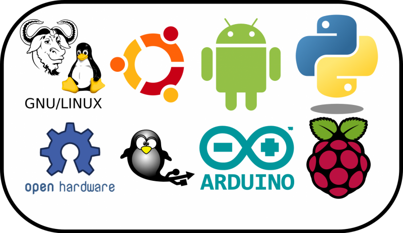
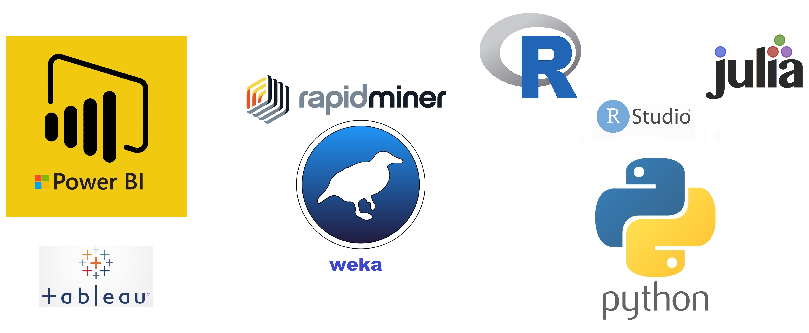

class: inverse, center, middle

# Lenguaje de programación
<html>

</html> 

---

# Concepto

.pull-left[
 

]

.pull-right[
 
- Un lenguaje de programación es un lenguaje formal, es decir, un lenguaje con reglas gramaticales bien definidas. Le proporciona a una persona (programador) la capacidad de escribir instrucciones o secuencias de órdenes en forma de algoritmos con el fin de controlar el comportamiento físico o lógico de una computadora, de manera que se puedan obtener diversas clases de datos o ejecutar determinadas tareas.
]

.footnote[
[1] [Tomado de wikipedia](https://es.wikipedia.org/wiki/Lenguaje_de_programaci%C3%B3n)
]

---
class: inverse, center, middle

# Software libre
<html>

</html> 

---

# Definición y 4 libertades

> "*«Software libre» es el software que respeta la libertad de los usuarios y la comunidad. A grandes rasgos, significa que los usuarios tienen la libertad de ejecutar, copiar, distribuir, estudiar, modificar y mejorar el software. Es decir, el «software libre» es una cuestión de libertad, no de precio. Para entender el concepto, piense en «libre» como en «libre expresión», no como en «barra libre».*"

## 4 Libertades del software libre

- La libertad de ejecutar el programa como se desee, con cualquier propósito (libertad 0).
- La libertad de estudiar cómo funciona el programa, y cambiarlo para que haga lo que usted quiera (libertad 1).
- La libertad de redistribuir copias para ayudar a otros (libertad 2).
- La libertad de distribuir copias de sus versiones modificadas a terceros (libertad 3).

.footnote[
[1] [gnu.org](https://www.gnu.org/philosophy/free-sw.es.html)
]

---

# Free Software Foundation (FSF)

## *Richard Stallman*

.footnote[
[1] [Página web de FSF.](https://www.fsf.org/es)
]

---
class: inverse, center, middle

# Lenguaje R
<html>

</html>

---

# Lenguaje R

- R es un lenguaje de distribución libre (bajo la [licencia GPL - General Public License](https://en.wikipedia.org/wiki/GNU_General_Public_License)), interpretado y de gran uso en la manipulación de datos para el cómputo estadístico y gráfico. Disponible para Linux, MacOS y Windows. R fue creado por Ross Ihaka y Robert Gentleman a principios de los años 90 en Nueva Zelanda, y puede ser definido como una implementación del lenguaje S, este último desarrollado en AT&T por John Chambers, Rick Becker y Allan Wilks.

- John Chambers y Trevor Hastie en el año 1991 describen en el texto Statistical Models in S:

> *"Buscamos que los usuarios puedan iniciar en un entorno interactivo, en el que no se vean, conscientemente, a ellos mismos como programadores. Conforme sus necesidades sean más claras y su complejidd se incremente, deberían gradualmente poder profundizar en la programación, es cuando los aspectos del lenguaje y el sistema se vuelven más importantes".*

---

# Top Lenguajes 2020

 

.footnote[
[1] [ieee.org](https://spectrum.ieee.org/static/interactive-the-top-programming-languages-2020)
]

---
class: inverse, center, middle

# Tecnologías libres
<html>

</html>

---

# Software y Hardware Libre

 

---

# Open Data

 

- [Datos abiertos Colombia.](https://www.datos.gov.co/)
- [Datos abiertos Banco Mundial.](https://datos.bancomundial.org/)

---
class: inverse, center, middle

# ¿Ciencia de datos?
<html>

</html> 

---
# Ciencia de datos

 

---
# Científico de datos

 
 
 
 
 

.footnote[
[1] [Artículo.](https://hbr.org/2012/10/data-scientist-the-sexiest-job-of-the-21st-century)
]

<!--Resaltando texto en color .red[rojo], .orange[naranja] y .blue[azul].-->

---
# Conceptos relacionados

 

---
# Inteligencia Artificial (IA)

 

---
# Uso masivo de la información

 
 
 
 

---

# Herramientas: software

 
 
 
 

---
class: inverse, center, middle

# Aplicaciones en agricultura
<html>

</html> 

---

# SIPRA: Colombia

.footnote[
[1] [Página web SIPRA Colombia.](https://sipra.upra.gov.co/)
]

 

---

# Agrosavia: sistemas de información

.footnote[
[1] [Sistemas de información Agrosavia.](https://www.agrosavia.co/productos-y-servicios/sistemas-de-informaci%C3%B3n)
]

 

---

# SoilGrids

- [Artículo SoilGrids.](https://journals.plos.org/plosone/article?id=10.1371/journal.pone.0169748)

.footnote[
[1] [Página web SoilGrids.](https://soilgrids.org/)
]

---

# TensorFlow en la agricultura

<iframe width="800" height="500" src="https://www.youtube.com/embed/NlpS-DhayQA" frameborder="0" allowfullscreen></iframe>

---

# TensorFlow en la agricultura

<iframe width="800" height="500" src="https://www.youtube.com/embed/23Q7HciuVyM" frameborder="0" allowfullscreen></iframe>

---

# TensorFlow en producción lechera

<iframe width="800" height="500" src="https://www.youtube.com/embed/6taIMlZysJQ" frameborder="0" allowfullscreen></iframe>

---
class: inverse, center, middle

# Instalación de herramientas
<html>

</html> 

---

# R + RStudio

 
 

- [Descargar R (última versión) - Windows.](https://cran.r-project.org/bin/windows/base/R-4.0.4-win.exe)
- [Descargar R (última versión) - MacOS.](https://cran.r-project.org/bin/macosx/R-4.0.4.pkg)
- [Descargar RStudio (última versión) - Windows.](https://download1.rstudio.org/desktop/windows/RStudio-1.4.1106.exe)
- [Descargar RStudio (última versión) - MacOS.](https://download1.rstudio.org/desktop/macos/RStudio-1.4.1106.dmg)

---
class: inverse, center, middle

# ¿Por qué RStudio?
<html>

</html>

---

# Proceso de análisis de datos

 
 
 

---

# Componentes del Tidyverse

 
 
 
 

.footnote[
[1] [Página web del *Tidyverse*.](https://www.tidyverse.org/)
]

---
class: inverse, center, middle

# ¡Gracias!

<html>

</html> 

