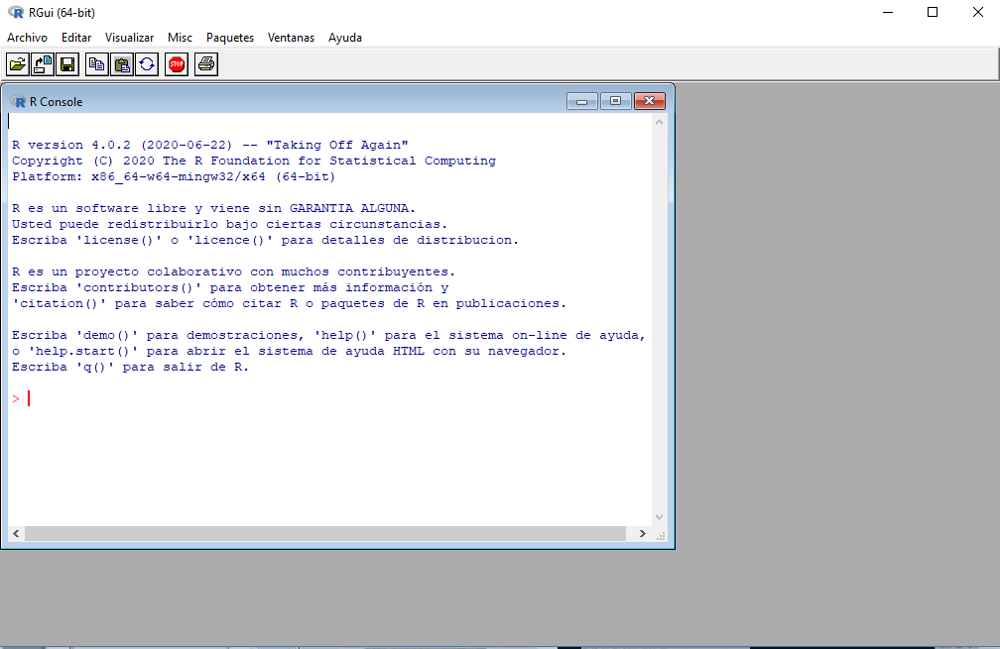
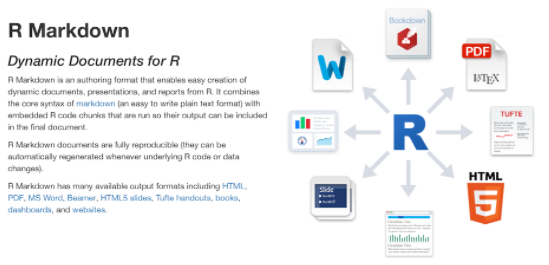
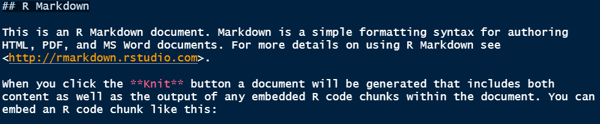

class: inverse, center, middle

# GUI R vs IDE RStudio
<html><div style='float:left'></div><hr color='#EB811B' size=1px width=720px></html> 

---

# Interfaz gráfica de usuario

<center>

</center>

---

# Entorno de desarrollo integrado

<center>

</center>

---
class: inverse, center, middle

# Elementos básicos de R
<html><div style='float:left'></div><hr color='#EB811B' size=1px width=720px></html> 

---
# Para iniciar...

.pull-left[

- **Ejecutar código:**

<center>

</center>


<center>

</center>

]

.pull-right[

- **Limpiar consola:**

<center>

</center>

- **Asignación (<-):**

```r
  a <- 2
* a = 2 # No recomendado 
```

- **R discrimina minúsculas de mayúsculas:**

```r
  edimer <- 2
  Edimer <- 2
```
]

---
# Generalidades

--

.pull-left[
### Formatos

- **Formato plano:** archivo con extensión *.R*
- **Formato estructurado:** archivo con extensión *.Rmd*

<center>

</center>

]

--

.pull-right[

- **Formato plano:** 
    - **Abrir:** *File* `->` *New File* `->` *R Script*
    - **Guardar:** *File* `->` *Save with Encoding* `->` *UTF-8*
  
- **Formato estructurado:**
    - **Abrir:** *File* `->` *New File* `->` *R Markdown*
    - **Guardar:** *File* `->` *Save with Encoding* `->` *UTF-8*

]

--

.footnote[
  **Nota:** la codificación *UTF-8* es recomendada para el lenguaje castellano.
]

---

# Elementos básicos de R

--

.pull-left[

- **Directorio de trabajo:** 
    - uso de funciones `getwd()` y `setwd()`.
    - *Session* `->` *Set Working Directory* `->` *Choose Directory*.

- **Sistema de codificación:** para el lenguaje castellano se recomienda utilizar la codificación **UTF-8**.

```r
  produccion <- 2
* producción <- 2
```


]

--

.pull-right[


- **Comentario:** el comentario en R se denota con un numeral (**#**).

```r
* # Este es un comentario
* 2 + 2 # Esta es una suma 
```

- **Nombres de variables:**

```r
* # Bueno
* mi_variable <- 2
  
  # Malo
  mi_variable_numero_uno <- 2

```

- **Sintaxis:**

```r
* # Bueno
  promedio <- mean(variable, na.rm = TRUE)

  # Malo
  promedio<-mean(variable,na.rm=TRUE)
```

]

--

.footnote[
  [Guía de estilo para R.](http://adv-r.had.co.nz/Style.html)
]

---
class: inverse, center, middle

# Ecosistema R Markdown
<html><div style='float:left'></div><hr color='#EB811B' size=1px width=720px></html> 

---

# Abrir R Markdown

- *File* `->` *New File* `->` *R Markdown*

<center>

</center>

---

# Componentes de R Markdown

- **Metadatos:**

<center>

</center>

- **Fragmentos (chunk) de R: **

<center>

</center>

- **Markdown:** 

<center>

</center>

---

# Elementos básicos de Markdown

.pull-left[
- **Título o encabezados:** 
```
# Título principal
## Título secundario
### Título 3
```
- **Opciones de texto:**
```
**cursiva*
***negrilla**
****negrilla cursiva***
```

- **Viñetas:** las viñetas se pueden agregar con guión, asterisco o el símbolo más (+).

- **Hipervínculos:** 
```
[Texto](link o url)
```
]

.pull-right[

- **Insertar imagen:**
```

```

- **Teclas de acceso rápido:**
    - **Ctrl + Shift + K **`->` compilar documento.
    - **Ctrl + Alt + i **`->` insertar fragmento de R.

<center>

</center>

- [R Markdown: The Definitive Guide.](https://bookdown.org/yihui/rmarkdown/)

]

---

# Editando metadatos

.pull-left[
- **`title`:** título principal del documento.
- **`subtitle`:** subtítulo.
- **`date`:** fecha.
- **`output`:** tipo de salida.
    - **`toc`:** opción para activar tabla de contenidos.
    - **`toc_depth`:** configurar los encabezados a tener en cuenta para la tabla de contenidos.
    - **`toc_float`:** tabla de contenido flotante.
        - **`collapsed`:** tabla de contenido flotante y plegable.
        - **`smooth_scroll`:** animaciones de tabla de contenido con el clic.
    - **`number_sections`:** numeración de secciones.
]

.pull-right[

- **`output`:** tipo de salida.
    - **`theme`:** tema del documento.
    - **`highlight`:** estilo de resaltado.
    - **`df_print`:** impresión de `data.frame` con formato.
    - **`code_folding`:** opción que permite mostrar u ocultar el código en el documento
    - **`css`:** personalización avanzada a través de `css`.

<center>

</center>
]

---

# Editando fragmentos de R

<br>
- Insertar fragmento de R con `Ctrl + ALt + i`.
- **`fig.align`:** alineación de gráficos.
- **`fig.width:`** ancho de gráficos.
- **`fig.height:`** altura de gráficos.
- **`echo:`** opción para imprimir el código en el documento.
- **`eval:`** opción para evaluar el código, es decir, producir resultados.
- **`warning:`** opción para desactivar las advertencias.
- **`message:`** opción para desactivar los mensajes.

<center>

</center>

---

# Tipos de documentos con R Markdown

.pull-left[
- Documentos:
    - `html_document`
    - `github_document`
    - `latex_document`
    - `md_document`
    - `odt_document`
    - `pdf_document`
    - `rtf_document`
    - `word_document`
- Presentaciones (diapositivas):
    - `ioslides_presentation`
    - `slidy_presentation`          
    - `beamer_presentation`          
    - `power_presentation`
]

.pull-right[

<br>

<center>

</center>
]

---

# Presentaciones HTML

- Crear archivo de extensión ***.Rmd***
    - *File -> New File -> R Mardown -> Presentation -> Ioslides*

<center>
 
  
```{r, echo=FALSE, out.width="515px", out.height="320px"}
knitr::include_graphics("img/present.png")
```

</center> 

  - Guardar archivo **.Rmd**
      - *File -> Save with Encoding -> UTF-8.*
  - Nueva diapositiva con `##`.
  - Diapositiva de tema principal con `#`.

---
class: inverse, center, middle

# Publicar en Rpubs

Publicación de documentos en  [Rpubs.](https://rpubs.com/)
Regístrese [aquí.](https://rpubs.com/users/new)    

---
class: inverse, center, middle

# ¡Gracias!

<html><div style='float:left'></div><hr color='#EB811B' size=1px width=720px></html> 

<center>

</center>

