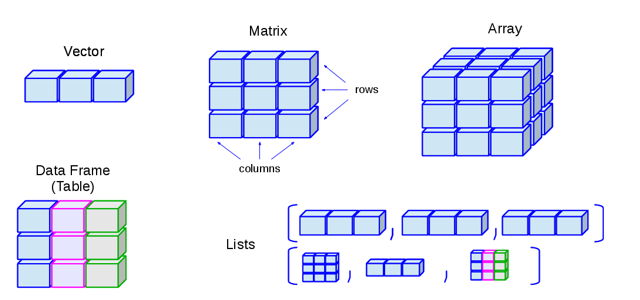
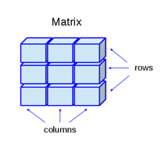

class: inverse, center, middle

# Datos IMC (Índice de Masa Corporal)
<html>

</html> 

---

# Datos en varios formatos

- **Formatos planos:**
  - 
  - 
  - 
  - 
- **Formatos estructurados:**
  - [IMC - Excel (.xlsx)](temas/05-Matriz-Listas-BDatos/data/imc_total.xlsx)

---

class: inverse, center, middle

# Tipos de datos en R
<html>

</html> 

---
class: inverse, center, middle

# Matrices y listas en R
<html>

</html> 

---

# Matrices y listas

.pull-left[

### Matrices

- **Almacenan datos de un sólo tipo**
- Se generan con la función `matrix()`
- Las matrices poseen atributos como nombres y dimensiones
  - `names()`, `rownames()`, `colnames()`, `dim()`, `dimnames()`, `nrow()`, `ncol()`
- Subconjuntos `->` `[filas, columnas]`

]

.pull-right[

### Listas

- **Almacenan datos de diferente tipo**
- Se generan con la función `list()`
- Subconjuntos `->` `[]` o `[[]]` o `$`
- Las listas poseen atributos como nombres `->` `names()`

##### ¿Cómo añadir nuevos datos a un vector, matriz o lista? 
  

]

---
class: inverse, center, middle

# Bases de datos

<html>

</html> 

---

# Data Frames

.pull-left[

- Se generan manualmente con la función `data.frame()`
- Subconjuntos `->` `[]` o `[[]]` o `$`
- Poseen atributos como nombres y dimensiones `->` `names()`, `rownames()`, `colnames()`, `dim()`, `dimnames()`, `nrow()`, `ncol()`
- Importación de datos `->` `read.csv()`, `read.csv2()`, `read.table()` 
- Exportación de datos `->` `write.csv()`, `write.csv2()`, `write.table()` 

##### ¿Tibble y Data Frames? `->` ¿"Iguales"? 
  

]

.pull-right[

| Importar | Exportar | Separador |
| :--- | :----------------: | :----: |
| `read_csv()` | `write_csv()` | "," |
| `read_csv2()` | `write_csv2()` | ";" |
| `read_tsv()` | `write_tsv()`| " " |
| `read_delim()` | `write_delim()` | "otro" |

| Importar | Exportar |
| :--- | :----------------: |
| `read_xls()` | `WriteXLS()` (`WriteXLS`) |
| `read_xlsx()` | `write_xlsx()` (`writexl`) |
| `read_excel()` | 2 anteriores |

]

---
class: inverse, center, middle

# ¡Gracias!

<html>

</html> 

