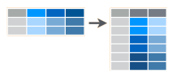
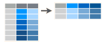

class: inverse, center, middle

# Datos ordenados `->` **Tidy Data**
<html>

</html> 

> [“Todos los set de datos ordenados se parecen unos a otros, pero cada set de datos desordenado lo es a su manera” — Hadley Wickham](https://vita.had.co.nz/papers/tidy-data.pdf)

---

# Propiedades de datos ordenados

.pull-left[
1. Cada variable debe tener su propia columna.
2. Cada observación debe tener su propia fila.
3. Cada valor debe tener su propia celda
]

.pull-rigth[

]

.pull-left[
- Nombres de columnas son valores, no nombres de variables.
- Múltiples variables almacenadas en una misma columna.
- Variables son almacenadas tanto en filas como en columnas.
]

.pull-rigth[
- Múltiples tipos de unidades observacionales  almacenadas en la misma tabla.
- Una misma observación es almacenada en varias tablas o bases de datos.

.foot-note[
[Fuente: Tidy data (Hadley Wickham).](https://vita.had.co.nz/papers/tidy-data.pdf)
]
]

---

# Formatos y funciones de uso común

.pull-left[

 
 

| Función | Tarea |
| :--- | :----: |
| `pivot_longer()` | Formato ancho a largo |
| `pivot_wider()` |  Formato largo a ancho |
| `separate()` |  separar una columna en dos o más variables |
| `unite()`  | unir dos o más columnas en una variable |

]

.pull-right[

- **`pivot_longer(data, cols, ...)`**

 
 

- **`pivot_wider(data, id_cols, ...)`**

 
 

- **`separate(data, col, into, sep, ...)`**

 
 

- **`unite(data, col, sep, ...)`:**

 
 

]

---

# Concatenando procesos (`%>%`)

.pull-left[

 
 

]

.pull-rigth[

 
 

]

 
 

.pull-left[

 
 

]

.pull-rigth[

 
 

]

- **Tecla de acceso rápido:** Ctrl + Shift + M

---
class: inverse, center, middle

# ¡Gracias!

<html>

</html> 

