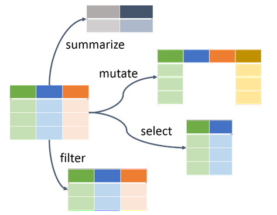
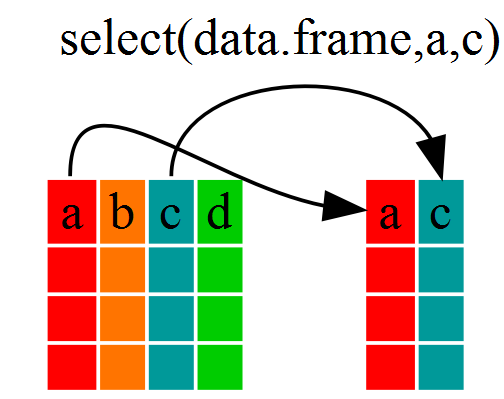
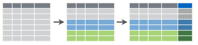
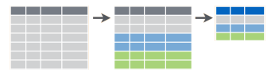
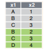

class: inverse, center, middle

# `Tidyverse`
<html><div style='float:left'></div><hr color='#EB811B' size=1px width=720px></html>


<center>

</center>

---

# Factores y funciones `apply`

.pull-left[

### Factores en R

  - Representan datos categóricos.
  - En R se pueden crear con la función `factor()`
  - Poseen *niveles* y *etiquetas*.
  - Funciones auxiliares con factores:
    - `levels()`, `as.factor()` 
    
```r
  factor(x = character(),
         levels,
         labels,
         ...)
```    

]

.pull-right[


### Familia `apply`


<center>

</center>


]

---
class: inverse, center, middle

# `dplyr`
<html><div style='float:left'></div><hr color='#EB811B' size=1px width=720px></html> 

<center>

</center>

---

# Operador de tubería


<center>

</center>


- **Ctrl + Shift + M** `->` acceso rápido

.foot-note[
[La traición de las imágenes](https://es.wikipedia.org/wiki/La_traici%C3%B3n_de_las_im%C3%A1genes) `->` [Pintor René Magritte](https://es.wikipedia.org/wiki/Ren%C3%A9_Magritte) `->` [Biblioteca magrittr](https://cran.r-project.org/web/packages/magrittr/vignettes/magrittr.html)
]

---

# ¿Qué permite `dplyr`?

<center>

</center>

---

# Funciones `dplyr`

.pull-left[

- **Operaciones por filas:**
  - `filter()`
  - `arrange()`
  - `slice()`
  - `distinct()`
- **Operaciones por columnas:**
  - `rename()`
  - `set_names()`<sup>1</sup>  
  - `select()`
  - `select_if()`
  
<center>

</center>  

]

.pull-right[

- **Resumen de datos:**

<center>

</center> 

  - `group_by()`
  - `ungroup()`
  - `summarise()` o `summarize()`
  - `count()`

- **Crear o editar variables:** `mutate()`
  

]

.foot-note[
[1] Función de biblioteca [purrr](https://purrr.tidyverse.org/)
]

---

# Diferencias `mutate()` y `summarise()`

.pull-left[

### `mutate()`

<center>

</center>

```r
base_datos %>% 
* group_by(factor) %>% 
  mutate(nueva = mean(variable))
```  

]

.pull-right[

### `summarise()`

<center>

</center>

```r
base_datos %>% 
* group_by(factor) %>% 
  summarise(nueva = mean(variable))
``` 

]

---
class: inverse, center, middle

# Ejercicio: [créditos agropecuarios 2020](https://www.datos.gov.co/Agricultura-y-Desarrollo-Rural/Colocaciones-de-cr-dito-Sector-Agropecuario-2020/hbaj-th4x)

<html><div style='float:left'></div><hr color='#EB811B' size=1px width=720px></html> 


<center>

</center>

---
class: inverse, center, middle

# Datos: [Boletín de mercado laboral en Colombia 2019](https://www.dane.gov.co/files/investigaciones/boletines/ech/ml_depto/Boletin_dep_19.pdf)

<html><div style='float:left'></div><hr color='#EB811B' size=1px width=720px></html> 

<center>

</center>

---

# Unión de datos

<center>

</center>

```r
* función_join(data1, data2, by = "ID")
``` 

.pull-left[
- `bind_rows(data1, data2)`
- `bind_cols(data1, data2)` 
]

.pull-right[
<center>

</center>

<center>

</center>

]

---
class: inverse, center, middle

# ¡Gracias!

<html><div style='float:left'></div><hr color='#EB811B' size=1px width=720px></html> 

<center>

</center>

