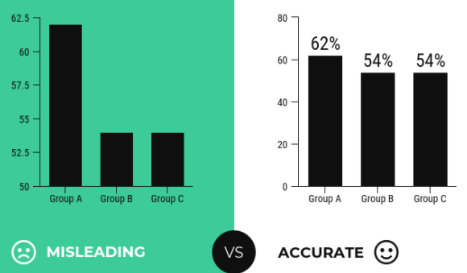
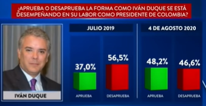
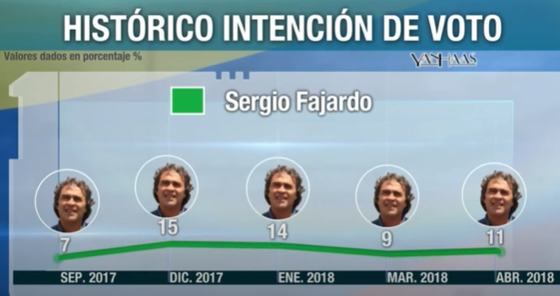
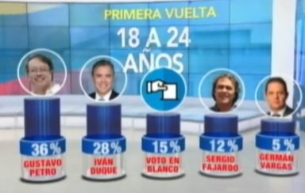

class: inverse, center, middle

# Introducción
<html>

</html> 

[Autor: Charles Joseph Minard](https://es.wikipedia.org/wiki/Charles_Joseph_Minard)

---

# ¿Cuál es el propósito de un gráfico?

.pull-left[

### [John W. Tukey](https://es.wikipedia.org/wiki/John_W._Tukey)

> *“Un simple gráfico ha brindado más información a la mente del analista de datos que cualquier otro dispositivo”*

]

.pull-right[

- Mejorar la compresión de los datos, es decir, que no confunden ni engañan.   
- Explorar y aprender acerca de la información recopilada.    
- Facilitar la comunicación de hallazgos e ideas a otras personas.    
- Búsqueda de patrones ocultos:   
  - Tendencias
  - Relaciones
  - Agrupaciones

#### ¿Todos los gráficos son buenos?

- **Respuesta:** ¡Noooo! [¡Los gráficos circulares  apestan!](https://medium.com/the-mission/to-pie-charts-3b1f57bcb34a)
- **Respuesta de [Edward Tufte](https://www.edwardtufte.com/tufte/):** *"el único diseño peor que un gráfico circular son varios de ellos"*.

]

---

class: inverse, center, middle

# [Gráficos engañosos](https://es.qaz.wiki/wiki/Misleading_graph)
<html>

</html>

---

# Características

.pull-left[
- Omitir la línea de base

- Manipular el eje Y

]

.pull-right[

- Datos "amañados"

- Usando el gráfico incorrecto

]

---

# Características

.pull-left[

- Ir en contra de las convenciones

]

.pull-right[

- Más ejemplos de gráficos engañosos:
  - [Misleading Graphs: Real Life Examples](https://www.statisticshowto.com/misleading-graphs/)
  - [Stopping COVID-19 with Misleading Graphs](https://towardsdatascience.com/stopping-covid-19-with-misleading-graphs-6812a61a57c9)
  - [13 Graphs That Are Clearly Lying](https://www.buzzfeednews.com/article/katienotopoulos/graphs-that-lied-to-us)
  - [Misleading Graphs and Statistics](https://faculty.atu.edu/mfinan/2043/section31.pdf)

]

.footnote[
[5 Ways Writers Use Misleading Graphs To Manipulate You [INFOGRAPHIC]](https://venngage.com/blog/misleading-graphs/)
]

---

# Gráficos engañosos: Colombia

---

# Gráficos engañosos: Colombia

---

# Gráficos engañosos: Colombia

---

# Gráficos engañosos: Colombia

---

# Gráficos engañosos: Colombia

---

# Gráficos engañosos: Colombia

---

# Gráficos engañosos: Colombia

---

# Gráficos engañosos: Colombia

---

class: inverse, center, middle

# Recursos sugeridos

---

# Recursos de información

.pull-left[

- [Data Visualization: A practical introduction](https://socviz.co/index.html)

- [La gramática de gráficos en capas (paper Hadley Wickham)](http://vita.had.co.nz/papers/layered-grammar.pdf)
- [Capítulo 3 R for Data Science - Visualización de datos](https://es.r4ds.hadley.nz/visualizaci%C3%B3n-de-datos.html)

]

.pull-right[

- [Fundamentals of Data Visualization](https://clauswilke.com/dataviz/)

- [Data Visualization with R](https://rkabacoff.github.io/datavis/)

]

---
class: inverse, center, middle

# ¡Gracias!

<html>

</html> 

