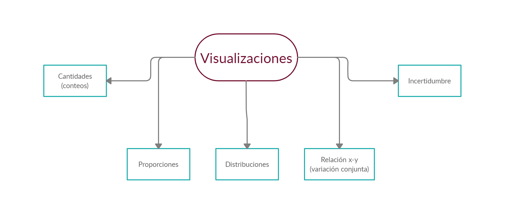
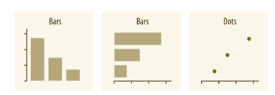
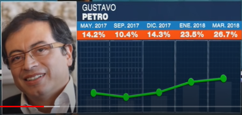
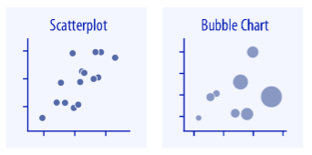
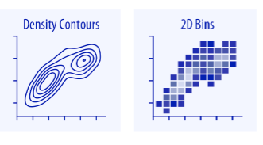
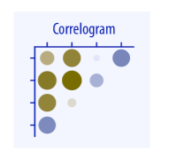
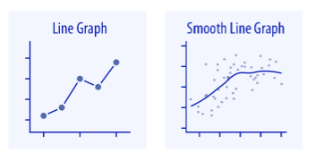
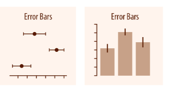
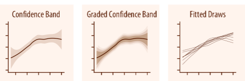
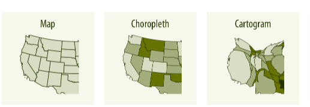

class: inverse, center, middle

# Introducción a `ggplot2`
<html><div style='float:left'></div><hr color='#EB811B' size=1px width=720px></html> 

<center>

</center>

---

# Estrategia de análisis

<center>

</center>


---

# Tipos de gráficos

<center>

</center>

---

# ¿Cómo funciona `ggplot2`?

<center>

</center>

.pull-left[

```r
  ggplot(data = datos,
         mapping = aes(x = mi_x, y = mi_y)) +
* geom_point() +
  labs(x = "Eje X", y = "Eje Y",
       title = "Título", subtitle = "Subtítulo") 
``` 

]

.pull-right[

```r
  datos %>% 
    ggplot(mapping = aes(x = mi_x, y = mi_y)) +
*   geom_point() +
    labs(x = "Eje X", y = "Eje Y",
         title = "Título", subtitle = "Subtítulo")
``` 

]

---

class: inverse, center, middle

# Directorio de gráficos
<html><div style='float:left'></div><hr color='#EB811B' size=1px width=720px></html> 

.foot-note[

[Imágenes tomadas de *Fundamentals of Data Visualization*](https://clauswilke.com/dataviz/)

<center>

</center>

]

---

# Cantidades y Proporciones

.pull-left[

#### Cantidades (conteos) - Individuales:

<center>

</center>

#### Proporciones - Individuales:

<center>

</center>

]

.pull-right[

#### Cantidades (conteos) - Agrupaciones:

<center>

</center>

#### Proporciones - Agrupaciones:

<center>

</center>

]

---

# Distribuciones

.pull-left[

#### Distribuciones - Individuales:

<center>

</center>

<br>

<center>

</center>

]

.pull-right[

#### Distribuciones - Agrupaciones:

<center>

</center>

]

---

# Relaciones *X - Y*

.pull-left[

#### Diagrama de dispersión (pocos datos):

<center>

</center>

#### Diagrama de dispersión (muchos datos):

<center>

</center>

]

.pull-right[

#### Correlograma:

<center>

</center>

#### *Y* vs Tiempo:

<center>

</center>

]

---

# Incertidumbre y Geoespacial

.pull-left[

#### Error estándar:

<center>

</center>

#### Bandas de confianza:

<center>

</center>

]

.pull-right[

#### Mapas:

<center>

</center>

#### Tipos de datos geoespaciales:

<center>

</center>

]

---

# Algunas funciones de `ggplot2`

.pull-left[

#### Mapeo estético y Objetos geométricos

| Función | Descripción |
| :--- | :----------------: |
| `ggplot()` | Función principal  |
| `geom_bar()` | Diagrama de barras |
| `geom_col()` | Diagrama de barras |
| `geom_histogram()` | Histogramas  |
| `geom_density()` | Densidades |
| `geom_boxplot()` | Boxplot  |
| `geom_point()` | Capa de puntos |
| `geom_line()` | Capa de líneas  |
| `geom_smooth()` | Suavizaciones |
| `geom_errorbar()` | Incertidumbre |

]

.pull-right[

#### Otras funciones

| Función | Descripción |
| :--- | :----------------: |
| `labs()` |  Etiquetas |
| `xlab()` |  Etiqueta eje X |
| `ylab()` |  Etiqueta eje Y |
| `ggtitle()` | Título de gráfico  |
| `geom_text()` | Añadir texto  |
| `scale_color_manual()` | Manejo de colores |
| `scale_fill_manual()` | Manejo de colores |
| `coord_flip()` | Dar la vuelta |
| `facet_wrap()` | Paneles o facetas |
| `facet_grid()` | Paneles o facetas |

]

---
class: inverse, center, middle

# Colores en R

<html><div style='float:left'></div><hr color='#EB811B' size=1px width=720px></html> 

<center>

</center>

---

# Gestión del color en R

- **Colores:**

```{r}
head(colors())
```


- **Paleta por defecto:**

```{r}
palette()
```

- **Otras paletas:**

```{r}
palette.pals()
```


---
class: inverse, center, middle

# ¡Gracias!

<html><div style='float:left'></div><hr color='#EB811B' size=1px width=720px></html> 

<center>

</center>

