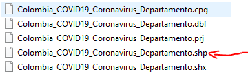

```{r setup, include=FALSE}
knitr::opts_chunk$set(echo = TRUE, warning = FALSE, message = FALSE,
                      fig.align = "center", fig.width = 8)
```

# Mapas desde R

## Descarga de mapas

- Utilizamos la biblioteca `raster`
- Para descargar [*shapes*](https://es.wikipedia.org/wiki/Shapefile) podemos utilizar la función `getData()`
- El siguiente código permite ver los nombres con codificación ISO para cada país, en este caso para Colombia el nombre es **COL**.

```{r}
library(raster)
getData(name = "ISO3")
```

- **Obtención de datos con función getData() para Colombia:**

  - `level = 0`: división a nivel de país.
  - `level = 1`: división regional (departamentos)
  - `level = 2`: división municipal (municipios)
  
```{r}
colombia_pais <- getData(name = "GADM", country = "COL", level = 0)
colombia_dept <- getData(name = "GADM", country = "COL", level = 1)
colombia_muni <- getData(name = "GADM", country = "COL", level = 2)
```

- Ahora podemos graficar cada mapa a través de la función `plot()`:

```{r}
plot(colombia_pais)
```

```{r}
plot(colombia_dept)
```

```{r}
plot(colombia_muni)
```

- Los objetos previamente creados son de tipo `SpatialPolygonsDataFrame`:

```{r}
class(colombia_pais)
```

- Podemos acceder a los nombres de cada departamento de la siguiente manera:

```{r}
colombia_dept$NAME_1
```


## Biblioteca `rworldxtra`

- La biblioteca `rworldxtra` posee mapas con información de interés, por ejemplo, la población mundial. Cargamos el conjunto de datos `countriesHigh` que es de tipo `SpatialPolygonsDataFrame`.

```{r}
library(rworldxtra)
data("countriesHigh")

class(countriesHigh)
```

- Graficamos con la función `plot()`:

```{r}
plot(countriesHigh)
```

# Biblioteca `sf`

- A través de la biblioteca `sf` podemos convertir los objetos de tipo `SpatialPolygonsDataFrame` a `data.frame`, facilitando el manejo con bibliotecas como `dplyr` o la visualización con `ggplot2`.
- La función `st_as_sf()` recibe un objeto de tipo `SpatialPolygonsDataFrame` y realiza la conversión a `data.frame`.
- En la variable mundo estamos asignando el objeto `countriesHigh` que habíamos cargado previamente. Cuando consultamos la clase vemos que es de tipo `data.frame` y `sf`.

```{r}
library(sf)
mundo <- st_as_sf(countriesHigh)
class(mundo)
```

- Veamos el objeto `mundo` como `data.frame()`:

```{r}
mundo %>% as.data.frame()
```

## Población mundial

- Ahora podemos graficar la población mundial (`POP_EST`) con `ggplot2` haciendo uso del objeto geométrico `geom_sf()`:

```{r}
library(ggplot2)
mundo %>% 
  ggplot(aes(fill = POP_EST)) +
  geom_sf() +
  labs(title = "Población mundial")
```

## Sur América y el Caribe

- Podemos filtrar sólo Sur América y el Caribe para ejemplificar cómo usar las funciones de `dplyr`. Además le asignamos colores diferentes con la biblioteca `viridis`.

```{r}
library(viridis)
library(dplyr)
mundo %>% 
  filter(continent == "South America and the Caribbean") %>% 
  ggplot(aes(fill = POP_EST)) +
  geom_sf() +
  scale_fill_viridis_c()
```

## Antioquia

- Podemos convertir los datos de Colombia a tipo `sf` o `data.frame`:

```{r}
municipios_df <- st_as_sf(colombia_muni)
municipios_df %>% as.data.frame()
```

- Filtramos sólo el departamento de Antioquia y graficamos:

```{r}
municipios_df %>% 
  filter(NAME_1 == "Antioquia") %>% 
  ggplot() +
  geom_sf()
```

## Cundinamarca

- Filtramos sólo el departamento de Cundinamarca y graficamos:

```{r}
municipios_df %>% 
  filter(NAME_1 == "Cundinamarca") %>% 
  ggplot() +
  geom_sf()
```

# Mapa COVID Colombia

## Descargar datos COVID

- Descargas datos actualizados por departamento desde [ESRI.](https://datosabiertos.esri.co/datasets/colombia-covid19-coronavirus-departamento)

- 1. Dar clic en descargar:

<center>

</center>

<br>

- 2. Seleccionar la opción *Hoja de Cálculo*:

<center>

</center>

<br>

- 3. El archivo descargado tendrá la siguiente apariencia en su computador:

<center>

</center>

<br>

- 4. Lectura de datos descargados y limpieza de nombres:

```{r}
library(readr)
library(janitor)
covid_deptos <- read_csv("data/Colombia_COVID19_Coronavirus_Departamento.csv") %>% 
  clean_names()
covid_deptos
```

## Unión de datos

- Vamos a unir los datos que descargamos previamente con la función `getData()` con la información de casos confirmados de Coronavirus por departamento. Cambiamos el nombre de la variable que contiene información del departamento para poder unirla con los datos del Coronavirus.

```{r}
datos_deptos <- st_as_sf(colombia_dept) %>% 
  rename(nombre_dpt = NAME_1)
datos_deptos %>% as.data.frame()
```

- Como los nombres de los departamentos en la base de datos del Coronavirus están en mayúscula los pasamos a minúscula con la primera letra en mayúscula, así quedarán igual a la base de datos que contiene el mapa de Colombia por departamentos.
- Vemos que la base de datos del Coronavirus tiene a Bogotá como departamento aislado de Cundinamarca, sin embargo, en la base de datos de los departamentos está incluido en Cundinamarca, por esta razón sumamos los de Bogotá (total 598993) a Cundinamarca. Cundinamarca tenía para el 27 de enero de 2021 91320 más 598993 de Bogotá, queda al final con 690313 casos confirmado. 
- Cambiamos el nombre de "Archipiélago de san andrés, providencia y santa catalina" a "San Andrés y Providencia" para que coincida en las dos bases de datos.
- Cambiamos el nombre de "Norte de santander" a "Norte de Santander" (S mayúscula) para que coincida en las dos bases de datos.
- Cambiamos el nombre de "Valle del cauca" a "Valle del cauca" (C mayúscula) para que coincida en las dos bases de datos.
- Cambiamos el nombre de "La guajira" a "La Guajira" (G mayúscula) para que coincida en las dos bases de datos.
- Finalmente eliminamos la fila que corresponde a Bogotá y Seleccionamos sólo la columna del nombre del departamento y los casos confirmados.

```{r}
library(Hmisc)
covid_deptos2 <- covid_deptos %>% 
  mutate(nombre_dpt = capitalize(tolower(nombre_dpt)),
         casos_confirmados = if_else(nombre_dpt == "Cundinamarca",
                                     true = casos_confirmados + 598993,
                                     false = casos_confirmados),
         nombre_dpt = gsub("Archipiélago de san andrés, providencia y santa catalina",
                           "San Andrés y Providencia",
                           nombre_dpt),
         nombre_dpt = gsub("Norte de santander",
                           "Norte de Santander",
                           nombre_dpt),
         nombre_dpt = gsub("Valle del cauca",
                           "Valle del Cauca",
                           nombre_dpt),
         nombre_dpt = gsub("La guajira",
                           "La Guajira",
                           nombre_dpt)) %>% 
  filter(nombre_dpt != "Bogotá, d.c.") %>% 
  select(nombre_dpt, casos_confirmados)
covid_deptos2
```

- Unión de datos del mapa por departamentos y casos confirmados de Coronavirus:

```{r}
df_mapa_covid <- inner_join(datos_deptos, covid_deptos2, by = "nombre_dpt")
df_mapa_covid %>% as.data.frame()
```

## Covid Departamentos

- Primer mapa:

```{r}
df_mapa_covid %>% 
  ggplot(aes(fill = casos_confirmados)) +
  geom_sf() +
  scale_fill_viridis_c()
```

- Mejorando la estética del mapa anterior:

```{r}
library(scales)
df_mapa_covid %>%
  ggplot(aes(fill = casos_confirmados)) +
  geom_sf(color = "white") +
  scale_fill_viridis_c(
    trans = "log10",
    breaks = trans_breaks("log10",
                          function(x)
                            round(10 ^ x, digits = 0))
  ) +
  labs(fill = "Casos confirmados") +
  theme_void()
```

- Cambiando los colores:

```{r}
library(scales)
df_mapa_covid %>%
  ggplot(aes(fill = casos_confirmados)) +
  geom_sf(color = "white") +
  scale_fill_viridis_c(
    option = "C",
    trans = "log10",
    breaks = trans_breaks("log10",
                          function(x)
                            round(10 ^ x, digits = 0))
  ) +
  labs(fill = "Casos confirmados") +
  theme_void()
```

## *Shape* Covid

- En los ejemplos previos juntamos las bases de datos de los mapas y los casos del Coronavirus, sin embargo, podemos [descargar](https://datosabiertos.esri.co/datasets/colombia-covid19-coronavirus-departamento) directamente el archivo *shape* de Coronavirus por departamentos en Colombia y graficarlo.

- 1. Dar clic en descargar:

<center>

</center>

<br>

- 2. Seleccionar la opción *Shapefile*:

<center>

</center>

<br>

- 3. El archivo descargado tendrá la siguiente apariencia en su computador:

<center>

</center>

<br>

- 4. Descomprimir el *zip* y tendrá en su directorio los siguientes archivos:

<center>

</center>

<br>

- 5. Lectura de datos descargados y conversión a tipo `sf`:

```{r}
shape_covid <- read_sf("data/Colombia_COVID19_Coronavirus_Departamento.shp")
shape_covid 
```

- Mapa:

```{r}
shape_covid %>%
  ggplot(aes(fill = Casos_Conf)) +
  geom_sf(color = "white") +
  scale_fill_viridis_c(
    option = "C",
    trans = "log10",
    breaks = trans_breaks("log10",
                          function(x)
                            round(10 ^ x, digits = 0))
  ) +
  labs(fill = "Casos confirmados") +
  theme_void()
```


