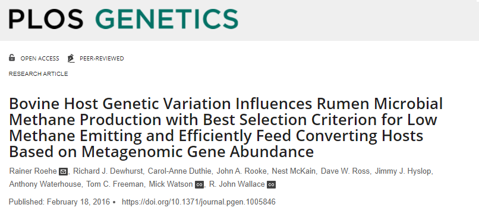

class: inverse, center, middle

# Estadística Descriptiva e Inferencial
<html><div style='float:left'></div><hr color='#EB811B' size=1px width=720px></html> 

<br>

<center>

</center>

---

# Propósito

<br>

<center>

</center>

---

# Muestras representativas

<br>

<center>

</center>

---

class: inverse, center, middle

# Modelos Estadísticos
<html><div style='float:left'></div><hr color='#EB811B' size=1px width=720px></html> 

---

# Tipos de modelos

<br>

<center>

</center>

---

# Métodos estadísticos

<center>

</center>

| Tipo de análisis | Método Paramétrico | Método no Paramétrico |
| :--- | :----------------: | :----: |
| Correlación | *Pearson* | *Spearman* o *Kendall* |
| Comparar medias (2 grupos) | *t-Student* | *Wilcoxon* |
| Comparar medias (> 2 grupos) | *Anova*  | *Kruskal-Wallis* |

---

# Tipos de hipótesis


<center>

</center>


<center>

</center>

---
class: inverse, center, middle

# Ejemplo 1: *Efecto de dietas sobre el crecimiento de 4 líneas de pollo de engorde*

<html><div style='float:left'></div><hr color='#EB811B' size=1px width=720px></html> 

<center>

</center>

[Artículo y datos.](https://journals.plos.org/plosone/article?id=10.1371/journal.pone.0127819#abstract0)

---
class: inverse, center, middle

# Ejercicio (10%): *Producción de metano en bovinos de dos razas con dos tipos de alimentación*

<html><div style='float:left'></div><hr color='#EB811B' size=1px width=720px></html> 

<center>

</center>

[Artículo y datos.](https://journals.plos.org/plosgenetics/article?id=10.1371/journal.pgen.1005846#sec018)

---

# Ejercicio

1. Comparar la emisión de metano por día (`methane_g_day`) para las dos razas y los dos tipos de dietas.
2. En cada comparación, comprobar el supuesto de normalidad a través de gráficos y prueba analítica.
3. En cada comparación, comprobar el supuesto de homocedasticidad a través de gráficos y prueba analítica.
4. Ejecute la prueba estadística que considere pertinente basado en el resultado de los numerales anteriores. Interprete los resultados obtenidos.

```{r, warning=FALSE, message=FALSE}
library(readxl); library(tidyverse); library(janitor)
datos <- read_excel("data/S1 Dataset.xlsx", skip = 1) %>% 
  clean_names()
head(datos, n = 3L)
```


---
class: inverse, center, middle

# ¡Gracias!

<html><div style='float:left'></div><hr color='#EB811B' size=1px width=720px></html> 

<center>

</center>

