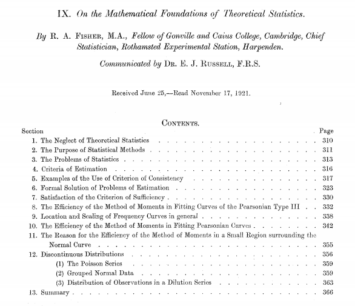
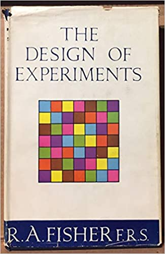
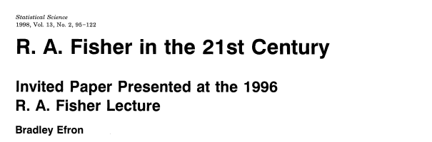
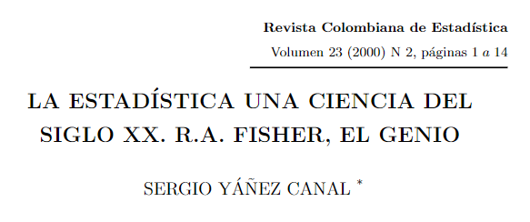
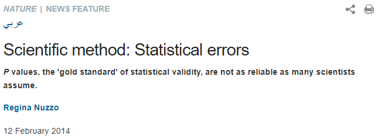
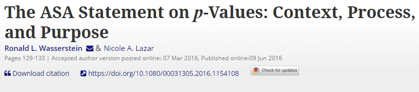

class: inverse, center, middle

# Diseño de Experimentos
<html><div style='float:left'></div><hr color='#EB811B' size=1px width=720px></html> 

<center>

</center>

---

# *Ronald Aylmer Fisher*

.pull-left[

<br>


<center>

</center>

]

.pull-right[

<br>


<center>

</center>


]

---

# *Fisher*, método científico y los valores p

.pull-left[

- [R. A. Fisher in the 21st Century (Bradley Efron)](https://projecteuclid.org/download/pdf_1/euclid.ss/1028905930)

<center>

</center>

- [La Estadística una ciencia del sigo XX. R.A. Fisher, el genio](https://revistas.unal.edu.co/index.php/estad/article/view/28348/28693)

<center>

</center>


- [Scientific method: Statistical errors](https://www.nature.com/news/scientific-method-statistical-errors-1.14700)

<center>

</center>

]

.pull-right[

<br>

- [The ASA Statement on p-Values: Context, Process, and Purpose](https://www.tandfonline.com/doi/full/10.1080/00031305.2016.1154108)

<center>

</center>

- [Statistics: P values are just the tip of the iceberg](https://www.nature.com/news/statistics-p-values-are-just-the-tip-of-the-iceberg-1.17412)

<center>

</center>


]

---

# El arte de la experimentación

.pull-left[ 

#### ¿Por qué hacer un experimento?

- Determinar las principales causas de variación en una respuesta medida
- Encontrar las condiciones que dan lugar a una respuesta máxima o mínima
- Obtener un modelo matemático para predecir respuestas futuras

#### Técnicas fundamentales

- Replicación `->`  Incrementa precisión
- Bloqueo `->` Incrementa precisión
- Aleatorización `->` Reduce el sesgo

]

.pull-right[

<br>

<center>

</center>


]

---

class: inverse, center, middle

# Análisis de Varianza
<html><div style='float:left'></div><hr color='#EB811B' size=1px width=720px></html> 

<center>

</center>

---

# Descripción del análisis de varianza

- Conjunto de modelos estadísticos usados para analizar diferencias de medias entre grupos en una muestra.
- Basado en la [ley de la varianza total](https://en.wikipedia.org/wiki/Law_of_total_variance), donde la varianza observada de una variable bajo análisis es particionada en componentes atribuibles a diferentes **fuentes de variación**.
- Permite generalizar la prueba *t-student* más allá de dos medias.
- La lógica general del análisis de varianza está fundamentada en la descomposición de la suma de cuadrados total en sumas de cuadrados entre (*tratamientos*) e intra (*error*) grupos:

$$SS_{Total} = SS_{Tratamientos} + SS_{Error}$$
- Visto como un función matemática podría expresarse de la siguiente forma:

$$y_{ij} = \mu + \tau_i + \epsilon_{ij}$$
Donde:
- $y_{ij}$: variable respuesta o dependiente
- $\mu$: media general (intercepto)
- $\tau_i$: efecto del $i-ésimo$ tratamiento
- $\epsilon_{ij}$: error aleatorio experimental, se debe garantizar que $\epsilon_{ij} \sim N(\mu=0,\sigma^2)$

---

# Supuestos del análisis de varianza

.pull-left[

Los residuales del modelo $(\epsilon)$ deben cumplir con:
- **Normalidad:** se puede verificar a través de histogramas, gráficos cuantil cuantil o con la prueba de *Shapiro-Wilk*.
- **Homocedasticidad:** se puede verificar a través valores ajustados (eje x) vs residuales (eje y) o con las pruebas de *Bartlett* o *Levene*. La primera es útil cuando la normalidad se cumple, de lo contrario es mejor usar la segunda.
- **Independencia**

- $\epsilon \sim N(\mu=0,\ \sigma^2)$

]

.pull-right[

- **Normalidad:**

```{r, echo=FALSE, fig.height=4}
set.seed(2021)
qqnorm(rnorm(100, 0, 1))
qqline(rnorm(100, 0, 1))
```

- **Homocedasticidad:**

```{r, echo = FALSE, fig.height=4}
modelo <- aov(iris$Sepal.Length ~ iris$Species)
ajustados <- fitted(modelo)
residuales <- residuals(modelo)
plot(ajustados, residuales)
abline(h = 0, col = "red")
```

]

---

# Homocedasticidad y heterocedasticidad

<center>

</center>

---
class: inverse, center, middle

# No olvidar que...

<html><div style='float:left'></div><hr color='#EB811B' size=1px width=720px></html> 

<center>

</center>

---
class: inverse, center, middle

# No cometer este error...

<html><div style='float:left'></div><hr color='#EB811B' size=1px width=720px></html> 

<center>

</center>

---
class: inverse, center, middle

# Ejemplo: *Agroecological coffee management increases arbuscular mycorrhizal fungi diversity*

<html><div style='float:left'></div><hr color='#EB811B' size=1px width=720px></html> 

<center>

</center>

[Artículo y datos](https://journals.plos.org/plosone/article?id=10.1371/journal.pone.0209093#sec016)

---
class: inverse, center, middle

# ¡Gracias!

<html><div style='float:left'></div><hr color='#EB811B' size=1px width=720px></html> 

<center>

</center>

