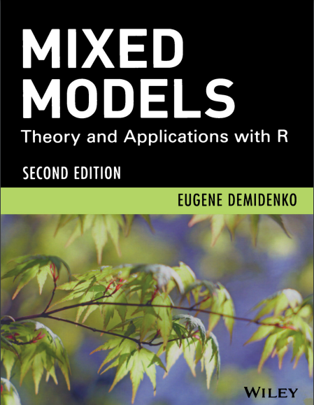

class: inverse, center, middle

# Diseño Experimental
<html>

</html> 

---

# Objetivos y unidades

### Objetivos

- Proporcionar los elementos necesarios para el planteamiento teórico y práctico del diseño de experimentos.
- Implementar técnicas estadísticas para el diseño y análisis de experimentos.
- Comprender la importancia del diseño y análisis estadístico de experimentos en la implementación del método científico.
- Usar herramientas técnológicas que faciliten el procesamiento de datos y la generación de conocimiento.

### Unidades

- **Unidad 1:** Análisis de regresión lineal simple y múltiple.
- **Unidad 2:** Introducción al diseño de experimentos (elementos de inferencia estadística). 
- **Unidad 3:** Diseños factoriales, cuadros latinos y parcelas divididas.
- **Unidad 4:** Modelos lineales mixtos (medidas repetidas en el tiempo).

---

# Evaluación del curso

 

- **Actividad 1:** 
  - Trabajo escrito
  - Resolución de ejercicios y problemas
  - 25 %
- **Actividad 2:** 
  - Trabajo escrito
  - Resolución de ejercicios y problemas
  - 25 %
- **Actividad 3:** 
  - Exposición y trabajo escrito
  - Ejemplo aplicado en un problema real bajo enfoque de Ciencia de Datos.
  - 50 %
  

---
class: inverse, center, middle

# Recursos de Información
<html>

</html>

---

# Design and Analysis of Experiments

.footnote[
[1] [Design and Analysis of Experiments](https://antivirus.uclv.edu.cu/update/libros/Mathematics%20and%20Statistics/Design%20and%20Analysis%20of%20Experiments%20-%20Angela%20Dean%2C%20Daniel%20Voss%2C%20Danel%20Dragulji%2C%202nd%20ed.%202017%20-%20978-3-319-52250-0.pdf)
]

 

---

# Statistical Inference via Data Science

.footnote[
[1] [Statistical Inference via Data Science](https://moderndive.com/)
]

 

---

# Design and Analysis of Experiments with R

.footnote[
[1] [Design and Analysis of Experiments with R](http://www.ru.ac.bd/stat/wp-content/uploads/sites/25/2019/03/502_07_00_Lawson_Design-and-Analysis-of-Experiments-with-R-2017.pdf)
]

---

# Mixed Models: Theory and Applications with R

.footnote[
[1] [Mixed Models: Theory and Applications with R](https://www.isical.ac.in/~arnabc/linmod/demidenko.pdf)
]

---

# Modelos Mixtos con R

.footnote[
[1] [Modelos Mixtos con R](https://fhernanb.github.io/libro_modelos_mixtos/)
]

---
class: inverse, center, middle

# ¡Gracias!

<html>

</html> 

