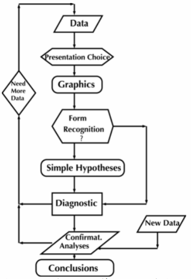

class: inverse, center, middle

# Método Científico
<html>

</html> 

---

class: inverse, center, middle

# ¿R, R Markdown, RStudio?
<html>

</html> 

---

# R y RStudio

.pull-left[

#### ¿Qué es R?

]

.pull-right[

#### ¿Qué es RStudio?

- RStudio es un entorno de desarrollo integrado (IDE) para R. [Página oficial de RStudio.](https://rstudio.com/)

#### Descargar R y RStudio

- [Descargar e instalar R y RStudio](https://posit.co/download/rstudio-desktop/)

] 

---

# Tipos de gráficos

.pull-left[

#### Tipos de gráficos

- Cantidades
- Proporciones
- Distribuciones
- Relación *X* vs *Y*
- Incertidumbre
- Mapas

]

.pull-right[

#### `ggplot2`

]

---

# Ejemplos de gráficos

.pull-left[

#### Relaciones lineales

#### Boxplots

]

.pull-right[

#### Relaciones no lineales

#### Histogramas

]

---

# Proceso de análisis de datos

.pull-left[

#### Fisher, Neyman, Pearson
    

    
    
    
    
]

.pull-right[

#### Tukey
  

    
  
  
]

.footnote[
[Fuente: Modern Statistics for Modern Biology](https://web.stanford.edu/class/bios221/book/)
]

---

class: inverse, center, middle

# Modelos Generativos
<html>

</html> 

---

# Estadística y Diseño Experimental

 

  

---

class: inverse, center, middle

# Inferencia Estadística
<html>

</html> 

---

# Parámetros de interés

| Parámetro Poblacional | Notación | Estadístico | Estimación | Hipótesis |
| :--- | :----------------: | :----: | :-----: | :-------: |
| Proporción poblacional | $p$ | $\hat{p}$  | Proporción muestral | $$H_0: p = \theta \\ H_1: p \neq \theta$$ |
| Media poblacional | $\mu$ | $\bar{x}$  | Media muestral | $$H_0: \mu = \theta \\ H_1: \mu \neq \theta$$ |
| Diferencia de proporciones poblacionales | $p_1 - p_2$ | $\hat{p_1} - \hat{p_2}$  | Diferencia de proporciones muestrales | $$H_0: p_1 - p_2 = 0 \\ H_1: p_1 - p_2 \neq 0$$ |
| Diferencia de medias poblacionales | $\mu_1 - \mu_2$ | $\bar{x_1} - \bar{x_2}$  | Diferencia de medias muestrales | $$H_0: \mu_1 - \mu_2 = 0 \\ H_1: \mu_1 - \mu_2 \neq 0$$ |

---

# Parámetros de interés en la regresión

$$\hat{y} = \hat{\beta_0} + \hat{\beta_1}X_{i1} + \hat{\beta_2}X_{i2} + ... + \hat{\beta_{p-1}}X_{i_{(p-1)}} +  \hat{\epsilon}$$

$$\beta = (X^TX)^{-1}X^Ty$$

| Parámetro Poblacional | Notación | Estadístico | Estimación | Hipótesis |
| :--- | :----------------: | :----: | :-----: | :-------: |
| Pendiente de regresión poblacional | $\beta_i$ | $\hat{\beta_i}$  | Pendiente de regresión muestral | $$H_0: \beta_i = 0 \\ H_1: \beta_i \neq 0$$ |

.pull-left[

#### Supuestos matemáticos de modelos lineales

- Normalidad
- Homocedasticidad
- Independencia
- Linealidad

]

.pull-right[

 

]

---

# Algunas preguntas de interés...

.pull-left[

- ¿Cuál es la proporción de semillas germinadas para la marca *X*?
- ¿Existen diferencias en la proporción de frutas afectadas para dos casas comerciales que proveen un producto que inhibe el efecto de plagas?
- ¿Cuál es el promedio del rendimiento (en toneladas por hectárea) para el cultivo de café en Colombia?
- ¿Existen diferencias en el promedio de producción de leche al suministrar el *aditivo A* vs *aditivo B* en la dieta de las vacas?
- ¿Existe alguna relación entre la cantidad de forraje verde consumido vs la producción de leche?
- ¿Existe alguna relación entre la edad de parto y el peso de los animales?

]

.pull-right[

 

]

---
class: inverse, center, middle

# ¡Gracias!

<html>

</html> 

