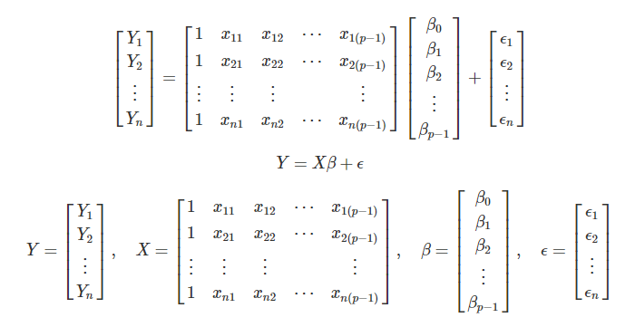
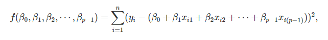
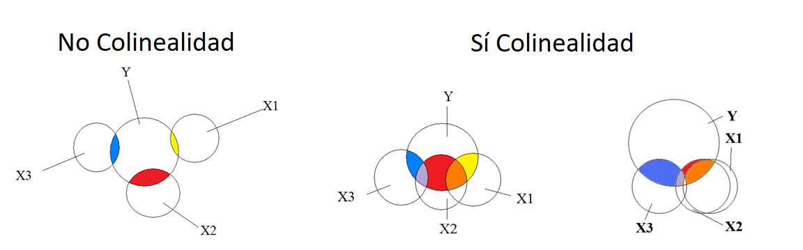

```{r setup, include=FALSE}
knitr::opts_chunk$set(echo = TRUE)
library(xaringanExtra)
xaringanExtra::use_panelset()
```

class: inverse, center, middle

# Regresión Lineal Múltiple
<html><div style='float:left'></div><hr color='#EB811B' size=1px width=720px></html> 

<center>

</center>

---

# Introducción

.panelset.sideways[

.panel[.panel-name[Modelos]

#### Modelo Lineal

$$y = b + mx \\$$

#### Modelo Lineal (Estadística)

$$y = \beta_0 + \beta_1X_i +  \epsilon \\ 
\hat{y} = \hat{\beta_0} + \hat{\beta_1}X_i +  \hat{\epsilon}$$

#### Modelo Lineal Múltiple

$$\hat{y} = \hat{\beta_0} + \hat{\beta_1}X_{i1} + \hat{\beta_2}X_{i2} + ... + \hat{\beta_{p-1}}X_{i_{(p-1)}} +  \hat{\epsilon}$$

]

.panel[.panel-name[Aproximación Matricial]

<center>

</center>

- Estimación por mínimos cuadrados:

<center>

</center>

$$\beta = (X^TX)^{-1}X^Ty$$

]


.panel[.panel-name[Hiperplano]

<center>

</center>

]

.panel[.panel-name[Supuestos Matemáticos]

- Normalidad
- Homocedasticidad
- Indepedencia
- Linealidad

<center>

</center>


]

.panel[.panel-name[Predictores Numéricos]


<center>

</center>

]

.panel[.panel-name[Predictores Categóricos]


<center>

</center>

]

]

---

# Regresión con muchas variables

.panelset.sideways[
  
.panel[.panel-name[Multicolinealidad]

- ¿Cómo detectarla o inferirla?
  - Matriz de correlación
  - Pruebas estadísticas (Factor Inflacionario de Varianza - *VIF*)
  - Valores de *VIF* mayores a 5 o 10 son indicios de sesgo en la estimación de los coeficientes.
  
$$VIF = \frac{1}{1-R^2_p}$$ 

<center>

</center>
         
]
  
.panel[.panel-name[Selección de Predictores]

- ¿Cómo comparar modelos?
  - RMSE
  - Criterios de información estadística:
      - $LogLik$: logaritmo de la [verosimilitud](https://en.wikipedia.org/wiki/Likelihood_function)
      - $AIC = -2 \times logLik + k + n$
      - $BIC = AIC,\ con\ k = log(n)$

#### Métodos paso a paso (*Stepwise*)

<center>

</center>
         
]
  
]


---
class: inverse, center, middle

# ¡Gracias!

<html><div style='float:left'></div><hr color='#EB811B' size=1px width=720px></html> 

<center>

</center>


