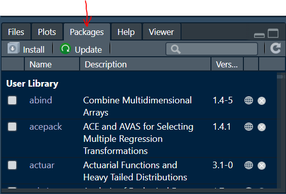
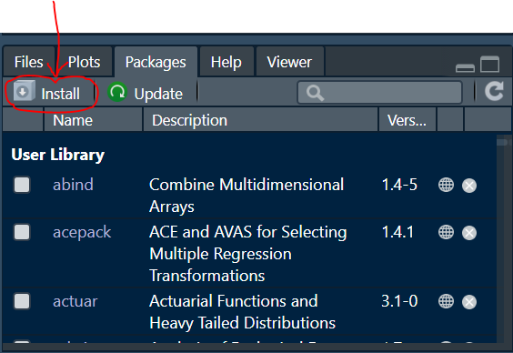
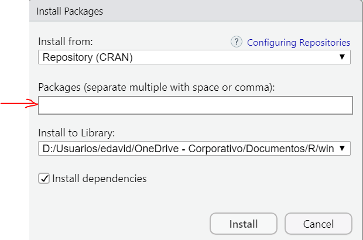
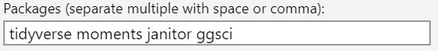
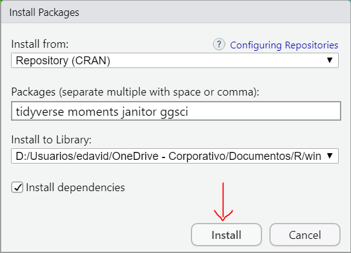

```{r setup, include=FALSE}
knitr::opts_chunk$set(echo = TRUE)
```

# Instalar bibliotecas desde RStudio

### 1. Abrir RStudio

### 2. Dar clic en la pestaña **`Packages`**

<center>

</center>

### 3. Dar clic en la pastaña **`Install`**

<center>

</center>

### 4. Escribir el nombre de las bibliotecas a instalar

<center>

</center>

En este caso se van a instalar las siguientes bibliotecas:

- `tidyverse`
- `moments`
- `janitor`
- `ggsci`

<center>

</center>

### 5. Clic en el botón **`Install`**

<center>

</center>
<br>
Se dará cuenta que la instalación terminó cuando en la consola aparezca nuevamente el símbolo `>`.