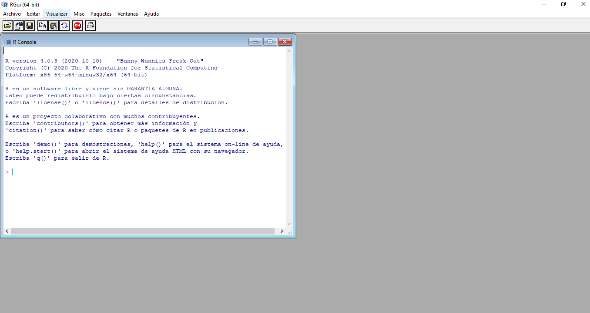
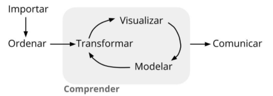

class: inverse, center, middle

# Motivación
<html><div style='float:left'></div><hr color='#EB811B' size=1px width=720px></html> 

<center>

</center>

---

# Ciencia de Datos (*Data Science*)

<center>

</center>

<center>

</center>

---

# Conceptos relacionados

<br>
<br>
<center>

</center>

---

class: inverse, center, middle

# Estadística Computacional
<html><div style='float:left'></div><hr color='#EB811B' size=1px width=720px></html> 

<center>

</center>

---

# R y RStudio

<center>

</center>

.pull-left[

#### ¿Qué es R?

  - R es un lenguaje de acceso libre para computación estadística y gráficos, que proporciona una amplia variedad de técnicas estadísticas y gráficas: modelado lineal y no lineal, pruebas estadísticas, análisis de series de tiempo, clasificación, agrupamiento, etc. [Página oficial de R.](https://cran.r-project.org/)

]

.pull-right[

#### ¿Qué es RStudio?

- RStudio es un entorno de desarrollo integrado (IDE) para R. [Página oficial de RStudio.](https://rstudio.com/)

#### Descargar R y RStudio

- [Clic aquí para descargar R](https://cran.r-project.org/bin/windows/base/R-4.0.4-win.exe)
- [Clic aquí para descargar RStudio](https://download1.rstudio.org/desktop/windows/RStudio-1.4.1106.exe)

]

---

class: inverse, center, middle

# Interfaz Gráfica de Usuario (GUI) - R
<html><div style='float:left'></div><hr color='#EB811B' size=1px width=720px></html> 

<center>

</center>

---

class: inverse, center, middle

# Entorno de Desarrollo Integrado (IDE) - RStudio
<html><div style='float:left'></div><hr color='#EB811B' size=1px width=720px></html> 

<center>

</center>

---

# Elementos básicos de R

.pull-left[

#### Ejecutar código de R

<center>

</center>

#### Limpiar consola

<center>

</center>

]

.pull-right[

#### Comentario en R

<center>

</center>

```{r}
# Este es un comentario
# 10 + 10
2 + 5
```

]

---

class: inverse, center, middle

# Proceso de Análisis de Datos
<html><div style='float:left'></div><hr color='#EB811B' size=1px width=720px></html> 

<center>

</center>

---
class: inverse, center, middle

# Ecosistema R Markdown
<html><div style='float:left'></div><hr color='#EB811B' size=1px width=720px></html> 

<center>

</center>

---

# Abrir R Markdown

- **Crear archivo:** *File* `->` *New File* `->` *R Markdown*

<center>

</center>

- **Guardar archivo:** *File* `->` *Save with Encoding* `->` *UTF-8*

---

# Componentes de R Markdown

- **Metadatos:**

<center>

</center>

- **Fragmentos (chunk) de R: **

<center>

</center>

- **Markdown:** 

<center>

</center>

---

# Elementos básicos de Markdown

.pull-left[
- **Título o encabezados:** 
```
# Título principal
## Título secundario
### Título 3
```
- **Opciones de texto:**
```
**cursiva*
***negrilla**
****negrilla cursiva***
```

- **Viñetas:** las viñetas se pueden agregar con guión, asterisco o el símbolo más (+).

- **Hipervínculos:** 
```
[Texto](link o url)
```
]

.pull-right[

- **Insertar imagen:**
```

```

- **Teclas de acceso rápido:**
    - **Ctrl + Shift + K **`->` compilar documento.
    - **Ctrl + Alt + i **`->` insertar fragmento de R.

<center>

</center>

- [R Markdown: The Definitive Guide.](https://bookdown.org/yihui/rmarkdown/)

]

---
class: inverse, center, middle

# Publicar en Rpubs

Publicación de documentos en  [Rpubs.](https://rpubs.com/)
Regístrese [aquí.](https://rpubs.com/users/new)  

---
class: inverse, center, middle

# ¡Gracias!

<html><div style='float:left'></div><hr color='#EB811B' size=1px width=720px></html> 

<center>

</center>

