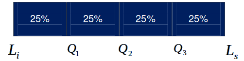
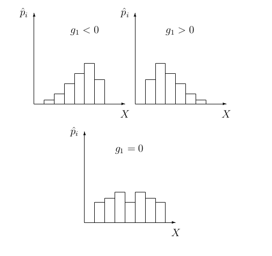

class: inverse, center, middle

# Medidas de resumen para una variable
<html><div style='float:left'></div><hr color='#EB811B' size=1px width=720px></html> 

---

# Medidas de resumen

- Las medidas de resumen permiten caracterizar la información que aportan los $n$ datos de la muestra bajo análisis.

- Los **estadísticos** o **valores típicos** pretenden caracterizar o describir la muestra, indicando el valor de la variable hacia el cual tienden a agruparse los datos.

<center>

</center>

---

class: inverse, center, middle

# Medidas de tendencia central
<html><div style='float:left'></div><hr color='#EB811B' size=1px width=720px></html> 

<center>

</center>

---

# Media aritmética

- **Media aritmética $(\bar{x})$:**   el promedio es la suma de los valores $x_{i}$ (observaciones) dividido por el tamaño $n$ de la muestra.
 
$$\bar{x}=\frac{\sum\nolimits_{i=1}^nxi}{n}=\frac{x_{1}+x_{2}+...+x_{n}}{n}$$

  - La media es susceptible a valores extremos.
  - Cuando se tienen variables discretas, es posible que el resultado de $\bar{x}$ no pertenezca al conjunto de valores posibles (***ej.*** el número de animales nacidos vivos).

### Promedio con R

```{r, eval = FALSE}
mean(x, na.rm = TRUE) # Media aritmética
```

- *`x`*: debe ser de tipo numérico o entero (cuantitativo).

---

# Media ponderada

- Medida apropiada cuando en un conjunto de datos cada uno de ellos tiene una importancia relativa (o peso) respecto de los demás datos.

$$\bar{X}_p = \frac{\sum\nolimits_{i=1}^nx_i\times w_i}{\sum\nolimits_{i = 1}^nw_i}=\frac{x_{1} \times w_1+x_{2} \times w_2+...+x_{n} \times w_n}{w_1 + w_2 + ...+w_n}$$
### Promedio ponderado en R

```{r, eval=FALSE}
weighted.mean(x, w, na.rm = TRUE)
```

- *`x`*: debe ser de tipo numérico o entero (cuantitativo).
- *`w`*: debe ser de tipo numérico o entero (cuantitativo).

---

# Mediana


- **Mediana:** la mediana es el valor central en el sentido del orden. La mediana deja por encima y por debajo de ella, el 50% de los datos.
  - No se afecta por valores extremos. 

<center>

</center>  
  
### Mediana con R

```{r, eval = FALSE}
median(x, na.rm = TRUE)
```

- *`x`*: debe ser de tipo numérico o entero (cuantitativo).


---

# Moda

- **Moda:** la moda es el valor que ocurre con mayor frecuencia, es decir, el dato que más se repite.
  - Unimodal: una sola moda
  - Bimodal: dos modas
  - Multimodal: más de dos modas  

### Moda en R

```{r, eval = FALSE}
moda <- function(x) {
  ux = unique(x)
  tab = tabulate(match(x, ux))
  ux[tab == max(tab)]
}
```

- *`x`*: puede ser de tipo cuantitativo o cualitativo.

---

# Relación de media, mediana y moda

- En distribuciones simétricas, la media, la mediana y la moda son aproximadamente iguales.
- En distribuciones con sesgo a la derecha (sesgo positivo), la media tiende a ser mayor que la mediana y la moda.
- En distribuciones con sesgo a la izquierda (sesgo negativo) la media tiede a ser menor que la mediana y la moda.

<center>

</center>

---

class: inverse, center, middle

# Medidas de posición
<html><div style='float:left'></div><hr color='#EB811B' size=1px width=720px></html> 

<center>

</center>

---

# Percentiles

- **Percentiles:** dividen la muestra en 100 partes iguales. Son los valores que dejan determinado porcentaje de observaciones por debajo de ellos. Por ejemplo, el percentil 10, es el valor superior al 10% de los datos, pero inferior al 90% restante.

<center>

</center>

Ubicación del percentil $k$: $$P_{k}=\frac{k(n+1)}{100}$$

### Percentiles en R

```{r, eval = FALSE}
quantile(x, na.rm = TRUE, probs = seq(0, 1, 0.01)) # Todos los percentiles
quantile(x, na.rm = TRUE, probs = 0.45) # Percentil 45
```

---

# Deciles

  - **Deciles:** dividen la muestra en 10 partes iguales.

<center>

</center>

Ubicación del decil $k$: $$D_{k}=\frac{k(n+1)}{10}$$

### Deciles en R

```{r, eval = FALSE}
quantile(x, na.rm = TRUE, probs = seq(0, 1, 0.1)) # Todos los deciles
quantile(x, na.rm = TRUE, probs = 0.20) # Decil 2
```

---

# Cuartiles

- **Cuartiles:** dividen la muestra en cuatro partes iguales.
  - Cuartil 1: 25% de las observaciones
  - Cuartil 2: 50% de las observaciones
  - Cuartil 3: 75% de las observaciones

<center>

</center>

Ubicación del cuartil $k$: $$Q_{k}=\frac{k(n+1)}{4}$$

### Cuartiles en R

```{r, eval = FALSE}
quantile(x, na.rm = TRUE, probs = seq(0, 1, 0.25)) # Todos los deciles
quantile(x, na.rm = TRUE, probs = 0.75) # Cuartil 3
```

---

class: inverse, center, middle

# Medidas de dispersión
<html><div style='float:left'></div><hr color='#EB811B' size=1px width=720px></html> 

<center>

</center>

---

# Varianza
  
  - **Varianza $(S^2)$:** proporciona una medida de dispersión de las distintas observaciones respecto a la media aritmética $\bar{x}$. Se define como la suma de los cuadrados de las diferencias entre cada valor de la muestra y su media.
    
- Para la población: $$\sigma^2=\frac{\sum\nolimits_{i=1}^n(x_{i}-\bar{x})}{N}^2$$

- Para la muestra: $$S^2=\frac{\sum\nolimits_{i=1}^n(x_{i}-\bar{x})}{n-1}^2$$

### Varianza en R

```{r, eval = FALSE}
var(x, na.rm = TRUE)
```

---

# D. Estándar y coeficiente de variación

- **Desviación estándar $(S)$:** se define como la raíz cuadrada de la varianza. Tiene la propiedad de estar definida en las mismas unidades de la variable analizada.
  
- Para la población:
$$\sigma=\sqrt{\sigma^2}$$
  
- Para la muestra:
$$S=\sqrt{S^2}$$
- **Coeficiente de variación $(CV)$:** se define como el cociente entre la desviación estándar y la media aritmética, expresado en porcentaje.
  
$$CV=\frac{S}{\bar{x}} \times 100$$
### Desviación estándar en R

```{r, eval = FALSE}
sd(x, na.rm = TRUE)
```

---

# Rango y rango intercuartílico

- **Rango:** es la diferencia entre el valor máximo y el mínimo. $$Máximo - Mínimo$$

- **Rango intercuartil:** el rango intercuartílico (RIQ) se obtiene como la diferencia entre los cuartiles 3 (Q3) y 1 (Q1). La mitad de las observaciones se clasifican dentro de este rango.

<center>

</center>

$$RIQ\ =\ Q3-Q1$$

#### Rango y rango intercuartílico en R

```{r, eval=FALSE}
range(x, na.rm = TRUE) #Rango
IQR(x, na.rm = TRUE) # Rango intercuartílico
```

---

class: inverse, center, middle

# Medidas de distribución o forma
<html><div style='float:left'></div><hr color='#EB811B' size=1px width=720px></html> 

<center>

</center>

---

# Coeficiente de asimetría

.pull-left[

- **Coeficiente de asimetría $(g_{1})$:** indica el grado de simetría de la distribución de datos. Puede ser:
  
- Distribución simétrica $si\ g_{1} = 0$
- Distribución asimétrica negativa $si\ g_{1} < 0$
- Distribución asimétrica positiva $si\ g_{1} > 0$

Fórmula del coeficiente de asimetría:

$$g_{1}=\left[\frac{{n}}{(n-1)(n-2)}\right]\left[\frac{\sum\nolimits_{i=1}^n(x_{i}-\bar{x})^3}{S^3}\right]$$

]

.pull-right[
<br>
<center>

</center>

]

- Instalar biblioteca `moments` `->` `skewness()`

---

# Coeficiente de curtosis

.pull-left[

- **Coeficiente de curtosis $(g_{2})$:** evalua el grado de concentración de los datos alrededor de la media y de los extremos (o colas). Puede ser:
  
- Distribución mesocúrtica $si\ g_{2}=0$
- Distribución leptocúrtica $si\ g_{2}>0$
- Distribución platicúrtica $si\ g_{2}<0$


Fórmula del coeficiente de curtosis:
<br>
<br>
$$g_{2}=\left[\frac{{n(n+1)}}{(n-1)(n-2)(n-3)}\right]\left[\frac{\sum\nolimits_{i=1}^n(x_{i}-\bar{x})^4}{S^4}\right]-\left[\frac{{3(n-1)^2}}{(n-2)(n-3)}\right]$$

]

.pull-right[
<center>

</center>

]

- Instalar biblioteca `moments` `->` `kurtosis()`

---

class: inverse, center, middle

# Funciones para estadística descriptiva con R
<html><div style='float:left'></div><hr color='#EB811B' size=1px width=720px></html> 


---

# Lista de funciones

| Función | Descripción | Tipo de variable |
| :--- | :----------------: | :----: |
| `mean()` | Calcular promedio | cuantitativa |
| `weighted.mean()` | Calcular promedio ponderado | Cunatitativa |
| `median()` | Calcular mediana | Cuantitativa |
| `sd()` | Calcular desviación estándar | cuantitativa |
| `var()` | Calcular la varianza  | Cuantitativa |
| `range()` | Calcular el rango | Cuantitativa |
| `IQR()` | Calcular rango intercuartílico | Cuantitativa |
| `quantile()` | Calcular cuartiles, deciles y percentiles | Cuantitativa |
| `min()` |  Valor mínimo | Cuantitativa |
| `max()` | Valor máximo  | Cuantitativa |
| * `moda()`  | Moda | Cuantitativa y cualitativa |

.foot-note[
*`->` Función personalizada.
]

---
class: inverse, center, middle

# Ejemplo Encuesta
<html><div style='float:left'></div><hr color='#EB811B' size=1px width=720px></html> 

<center>

</center>

---
class: inverse, center, middle

# ¡Gracias!

<html><div style='float:left'></div><hr color='#EB811B' size=1px width=720px></html> 

<center>

</center>


