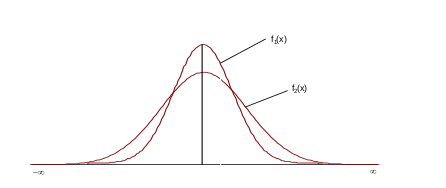
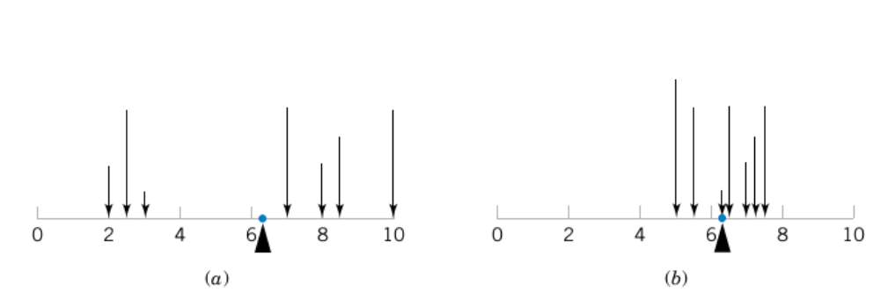

```{r echo=FALSE}
xaringanExtra::use_panelset()
```

class: inverse, center, middle

# Variable Aleatoria
<html><div style='float:left'></div><hr color='#EB811B' size=1px width=720px></html> 

<center>

</center>

---

# Variable aleatoria

.panelset[

.panel[.panel-name[Concepto]

- Un evento $A$ al cual atribuimos una probabilidad será llamado **evento aleatorio**.
- Una variable aleatoria (v.a.) es una función que asocia a cada elemento del espacio muestral $\Omega$ un número real. Se denota usualmente con letras mayúsculas (X, Y, Z).

<center>

</center>

]

.panel[.panel-name[Representación]

<center>

</center>

]

.panel[.panel-name[Tipos]

- **Discretas:** aquellas que sólo pueden tomar valores en un conjunto finito numerable.
- **Continuas:** aquellas que toman valores en uno o varios intervalos de la recta de los reales, en cuyo caso, el conjunto es no numerable.
  
### Distribución de una variable aleatoria

- Una variable aleatoria se define como un descriptor de eventos o sucesos aleatorios y su **función** de distribución asigna probabilidades a esos eventos.
- Variable aleatoria discreta:
    - Función masa de probabilidad (f.m.p.)
    - Función de distribución acumulada (f.d.a.)
- Variable aleatoria continua:
    - Función de densidad.
    - Función de distribución acumulada

]


]

---
class: inverse, center, middle

# Variable aleatoria discreta
<html><div style='float:left'></div><hr color='#EB811B' size=1px width=720px></html> 

```{r, echo=FALSE, warning=FALSE, message=FALSE, fig.align="center", fig.width=9}
library(readxl)
library(tidyverse)
datos <- read_excel("data/encuesta_depurada.xlsx")
theme_set(theme_minimal())
datos %>% 
  mutate(lectura = fct_relevel(lectura, "Nada", "Muy poco",
                               "Frecuentemente")) %>% 
  ggplot(aes(x = lectura)) +
  geom_bar(color = "black") +
  labs(x = "Hábito de lectura", y = "Frecuencia")
```

---

# Variable aleatoria discreta

.panelset[

.panel[.panel-name[Función masa de probabilidad (f.m.a.)]

La función masa de probabilidad (f.m.p) de una variable aleatoria discreta es un gráfico, tabla o fórmula que específica la probabilidad asociada a cada resultado del espacio muestral. $$f(x)=P(X=x)$$

<center>

</center>

Para la f.m.p se satisfacen las siguientes condiciones o propiedades:

  - $f(x_i) \geq 0$
  - $\sum\nolimits_{i=1}^xf(x_i) = 1$
  - $f(x_i) = P(X=x_i)$

]

.panel[.panel-name[Función de distribución acumulada (f.d.a.)]

Describe un evento particular, donde se asocia una probabilidad a los puntos muestrales de la variable aleatoria con un valor menor o igual que $x$. $$f(x)=P(X \leq x) = \sum P(x_i);  \ \forall\ x \in R $$

Para la f.d.a se satisfacen las siguientes condiciones:

  - $f(a)=P(X \leq a) = \sum\nolimits_{x=-\infty}^a P(x)$
  - $f(-\infty)=0$
  - $f(\infty)=1$

]

]


---
class: inverse, center, middle

# Variable aleatoria continua
<html><div style='float:left'></div><hr color='#EB811B' size=1px width=720px></html> 

```{r, echo=FALSE, warning=FALSE, message=FALSE, fig.align="center", fig.width=9}
datos %>% 
  ggplot(aes(x = horas_estudiar)) +
  geom_histogram(bins = 6, color = "black") +
  labs(x = "Horas dedicadas a estudiar", y = "Frecuencia")
```

---

# Variable aleatoria continua

.panelset[

.panel[.panel-name[Función de densidad]

La función de densidad de probablidad $f(x)$ describe la distribución de probabilidad de una variable aleatoria continua.

<center>

</center>

]

.panel[.panel-name[Función de densidad]

La probabilidad está determinada por el área bajo la curva desde un punto $a$ hasta el punto $b$. $$P(a < X < b) =\ área\ bajo\ la\ curva$$

<center>

</center>

]

.panel[.panel-name[Función de densidad]

$$P(a < X < b) = \int_{a}^{b} f(x)dx;  \ \forall\ a,b \in R $$

La función de densidad de una v.a. continua satisface las siguientes propiedaes:

  - $f(x)>0$
  - $\int_{-\infty}^{\infty} f(x) = 1$

]

.panel[.panel-name[F.D.A.]

De la definición de función de densidad de una variable aleatoria continua, se deduce que la función de distribución acumulada de esta variable puede ser obtenida a través de la siguiente expresión: $$P(X \leq x) = \int_{-\infty}^{x} f(x)dx$$

<center>

</center>


]

]

---
class: inverse, center, middle

# Medidas de resumen de una variable aleatoria
<html><div style='float:left'></div><hr color='#EB811B' size=1px width=720px></html> 

<center>

</center>


---

# Medidas de resumen

.panelset[

.panel[.panel-name[Localización diferente]

<br>
<br>

<center>

</center>

]

.panel[.panel-name[Variación diferente]

<center>

</center>

]

.panel[.panel-name[Igual localización y diferente variación]

<center>

</center>

]

]

---

# Esperanza matemática y varianza

.panelset[

.panel[.panel-name[Características]

1. A cada variable aleatoria se asocia una función de distribución.
2. El análisis del comportamiento de una variable se puede realizar mediante la descripción de su distribución, utilizando ciertos valores o parámetros que la caracterizan.
3. Si un experimento aleatorio es realizado y una variable aleatoria es definida, se puede determinar el **valor esperado** y la **varianza** de dicha variable aleatoria.

]

.panel[.panel-name[Esperanza matemática]

La esperanza matemática de una variable aleatoria se puede definir desde un punto de vista intuitivo, como el promedio de los valores asumidos por la variable, donde cada valor es "ponderado" por su probabilidad de ocurrencia.

- **Esperanza matemática de una variable aleatoria discreta:** $$E(X) = \mu = \sum\nolimits_{i=1}^n x_if(x_i)$$
- **Esperanza matemática de una variable aleatoria continua:** $$E(X) = \mu = \int_{-\infty}^{\infty} xf(x)dx$$

**Nota:** esta integral no siempre existe, en cuyo caso, se dirá que la variable aleatoria no tiene esperanza matemática.

]

.panel[.panel-name[Varianza]

La esperanza matemática de una varible aleatoria sólo proporciona información parcial acerca de su distribución, indicando dónde está posicionada, sin embargo, dos o más distribuciones pueden tener la misma medida de posición y aún así, ser diferentes. Por ello surge la necesidad de una medida que indique similitud entre los valores de la variable aleatoria.

- **Varianza de una variable aleatoria discreta:** $$Var(X) = \sigma^2 = \sum\nolimits_{x_i}^n (x_i - \mu)^2 f(x_i)$$
- **Varianza de una variable aleatoria continua:** $$Var(X) = E[(x - \mu)^2] = \sigma^2 = \int_{-\infty}^{\infty} (x - \mu)^2 f(x) dx $$

]

]


---
class: inverse, center, middle

# ¡Gracias!

<html><div style='float:left'></div><hr color='#EB811B' size=1px width=720px></html> 

<center>

</center>

