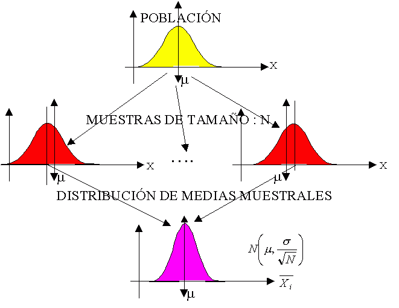
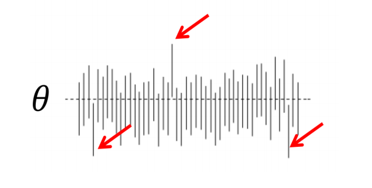

```{r echo=FALSE}
xaringanExtra::use_panelset()
```

class: inverse, center, middle

# Inferencia
<html><div style='float:left'></div><hr color='#EB811B' size=1px width=720px></html> 

<center>

</center>


---

# Inferencia

.panelset[

.panel[.panel-name[Métodos y Tipos]

- Métodos de inferencia estadística:
  - Clásico
  - Bayesiano
- Inferencia:
  - Estimación
    - Puntual
    - Intervalos
  - Pruebas de hipótesis

]

.panel[.panel-name[Conceptos]

- **Parámetro:** medida numérica que se obtiene con todos los datos de la población. Los parámetros generalmente son desconocidos.
- **Estadístico:** medida numérica que se obtiene de las muestras con determinado nivel de variación entre muestras.
- **Inferencia estadística:** proceso mediante el cual se generalizan conclusiones a la población, cuyo punto de partida son las muestras. Objetivos de la inferencia estadística:
  - Estimación de parámetros
      - Estimación puntual
      - Intervalos de confianza
  - Pruebas de hipótesis o test de significancia estadística
- Un estadístico muestral, proveniente de una muestra aleatoria, tiene un patrón de comportamiento (predecible) en repetidas muestras, dicho patrón se conoce como la distribución muestral del estadístico.
- Si se conoce la distribución muestral, es posible hacer inferencia estadística.

]

.panel[.panel-name[Elementos (1)]

- **Punto de partida:** situaciones cotidianas que afectan la realidad del ser humano.
- Tomar acciones frente a dichas situaciones requiere comprensión del sistema que las origina.
- **Etapa de “idealización”:** modelación.
  - La modelación tiene como objetivo identificar los elementos que son importantes y determinar sus relaciones.
  - Si el modelo es correcto, se constituye como una herramienta útil para planificar acciones.
- Un modelo deber ser validado, es decir, mostrar que las estimaciones que se deducen del mismo, son aceptables.
- Un modelo se considera correcto para determinada situación, cuano no existen diferencias significativas entre lo observado y lo esperado.
- ¿Qué es diferencia significativa?
  - Asignación de probabilidades al evento
  - La medida de probabilidad permitirá tomar la decisión basado en la evidencia observada

]

.panel[.panel-name[Elementos (2)]

- Hipótesis científica: modelo no validado
  - Si las consecuencias de la hipótesis científica se puede establecer como propiedades estadísticas de una variable aleatoria, entonces será posible implementar herramientas de inferencia estadística que permitan la validación del modelo.
  - Hipótesis científica en términos estadísticos como Hipótesis Estadística
      - Analizar datos muestrales
      - Cálculo de estadísticos muestrales
      - Distribución del estadístico muestral
      - Se rechaza o no la hipótesis estadística y, en consecuencia, la hipótesis científica

]

]

---

class: inverse, center, middle

# Estimación de parámetros
<html><div style='float:left'></div><hr color='#EB811B' size=1px width=720px></html> 

<center>

</center>

---

# Tipos de estimación

.panelset[

.panel[.panel-name[Estimación puntual]

<center>

</center>


]

.panel[.panel-name[Estimacón por intervalo]

<center>

</center>


]

.panel[.panel-name[Nivel de significancia]

- Nivel $\alpha$ de uso frecuente:
  - 0.10
  - 0.05
  - 0.01
- Nivel de confianza de uso frecuente:
  - 0.90
  - 0.95
  - 0.99
- $NC + \alpha = 1$


]

]

---

# Intervalos de confianza

.panelset[

.panel[.panel-name[Representación]

**Ejemplo con un $NC = 97\%(0.97)$ y $\alpha = 3\%(0.03)$**

<center>

</center>

]

.panel[.panel-name[Intervalos usuales]

- Para una muestra:
  - $\mu$
  - $p$
  - $\sigma^2$
- Para dos muestras:
  - $\mu_1 - \mu_2$
  - $\mu_1 - \mu_2\ (pareadas)$
  - $p_1-p_2$
  - $\sigma^2_1/\sigma^2_2$

]

]

---

class: inverse, center, middle

# Pruebas de Hipótesis
<html><div style='float:left'></div><hr color='#EB811B' size=1px width=720px></html> 

<center>

</center>

---

# Pruebas de hipótesis

.panelset[

.panel[.panel-name[Tipos de hipótesis]

<center>

</center>

]

.panel[.panel-name[Tipos de pruebas]

<center>

</center>

]

.panel[.panel-name[Pruebas usuales]

- Para una muestra:
  - $\mu$
  - $p$
  - $\sigma^2$
- Para dos muestras:
  - $\mu_1 - \mu_2$
  - $\mu_1 - \mu_2\ (pareadas)$ 
  - $p_1-p_2$
  - $\sigma^2_1/\sigma^2_2$

]

.panel[.panel-name[Etapas]

- Definir la hipótesis nula y la alternativa
- Tomar la muestra (muestreo)
- Calcular el estadístico (evidencias)
- Determinar el nivel $\alpha$    
- Calcular el valor P
- Concluir (toma de decisiones)

]

]

---

# Tipos de errores

<center>

</center>

- $\alpha$: máxima probabilidad de cometer el error tipo I
- **Potencia de la prueba $(1- \beta)$:** probabilidad de rechazar una hipótesis nula que es falsa. 

---

# Valor p

- Se puede definir como la probabilidad exacta de cometer el error tipo I.
- Probabilidad de obtener un estadístico de prueba (evidencias) igual al que se obtuvo o más extremo.
- Es la probabilidad calculada, suponiendo que la hipótesis nula es verdadera, de obtener un estadístico de prueba tan discrepante a $H_0$ como el valor que en realidad se obtuvo.
- En la medida que el valor P se hace más pequeño, más contradictorios son los datos con $H_0$

---

# Conclusión en pruebas de hipótesis

<center>

</center>

- Contraste de hipótesis:
  - Intervalos de confianza
  - Región de rechazo
  - Valor P


---
class: inverse, center, middle

# ¡Gracias!

<html><div style='float:left'></div><hr color='#EB811B' size=1px width=720px></html> 

<center>

</center>

