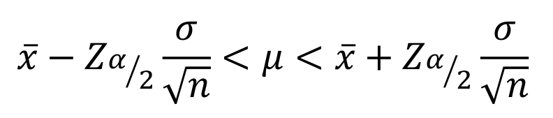
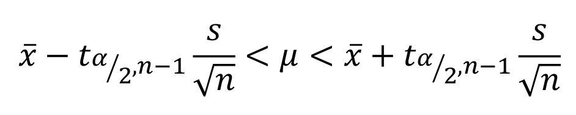

```{r echo=FALSE}
xaringanExtra::use_panelset()
```

class: inverse, center, middle

# Inferencia sobre  $\mu$
<html><div style='float:left'></div><hr color='#EB811B' size=1px width=720px></html> 

<center>

</center>

---

# Prueba de hipótesis para $\mu$

1. Comprobar que la variable aleatoria se distribuye de forma normal.
2. Definir la hipóteis nula y alternativa: $$H_0: nula$$
   $$H_1: alternativa$$
3. Calcular el estadístico $$t = \frac{\bar{X}- \mu_0}{s/\sqrt{n}}$$
4. Definir el error tipo I $\alpha$
5. Calcular el valor P en una distribución $t-student$ con $n-1$ grados de libertad
6. Comparar el valor P con $\alpha$ y concluir.

---

# Intervalos de confianza para $\mu$

.panelset[

.panel[.panel-name[Varianza conocida]

Si $\bar{x}$ es la media de una muestra aleatoria de tamaño $n$ de una población normal con varianza $\sigma^2$ conocida, un intervalo de confianza del $(1-\alpha)100\%$ para $\mu$ está dado por la siguiente expresión:

<center>

</center>

]

.panel[.panel-name[Valores *Z*]

<center>

</center>

- Nivel de confianza (NC) y $\alpha$: $Z_{\alpha/2}$:
  - $NC = 90\%,\ y\ \alpha = 0.10: Z_{\alpha/2} = 1.645$
  - $NC = 95\%,\ y\ \alpha = 0.05: Z_{\alpha/2} = 1.960$
  - $NC = 99\%,\ y\ \alpha = 0.01: Z_{\alpha/2} = 2.576$

]

.panel[.panel-name[Varianza desconocida]

Si $\bar{x}$ es la media de una muestra aleatoria de tamaño $n$ de una población normal con varianza $\sigma^2$ desconocida, un intervalo de confianza del $(1-\alpha)100\%$ para $\mu$ está dado por la siguiente expresión:

<center>

</center>

]

]

---

class: inverse, center, middle

# Inferencia sobre  $p$
<html><div style='float:left'></div><hr color='#EB811B' size=1px width=720px></html> 

<center>

</center>

---

# Prueba de hipótesis para $p$

1. Definir la hipótesis nula y alternativa 
$$H_0: nula$$
$$H_1: alternativa$$
2. Calcular el estadístico
$$Z_0 = \frac{\hat{p}-p_0}{\sqrt{\frac{p_0(1-p_0)}{n}}}$$
3. Definir el error tipo I $\alpha$
4. Calcular el valor P en una distribución normal estándar
5. Comparar el valor P con $\alpha$ y concluir.

---

# Intervalo de confianza para $p$

Si $\hat{p}$ es la proporción de éxitos en una muestra aleatoria de tamaño $n$, un intervalo de confianza del $(1-\alpha)100\%$ para $p$ está dado por la siguiente expresión:

<br>

$$\hat{p}-Z_{\alpha/2}\sqrt{\frac{\hat{p}(1-\hat{p})}{n}} < p < \hat{p}+Z_{\alpha/2}\sqrt{\frac{\hat{p}(1-\hat{p})}{n}}$$

---
class: inverse, center, middle

# [Statistical Inference via Data Science: A ModernDive into R and the Tidyverse](https://moderndive.com/index.html)

<html><div style='float:left'></div><hr color='#EB811B' size=1px width=720px></html> 

<center>

</center>


---
class: inverse, center, middle

# ¡Gracias!

<html><div style='float:left'></div><hr color='#EB811B' size=1px width=720px></html> 

<center>

</center>

