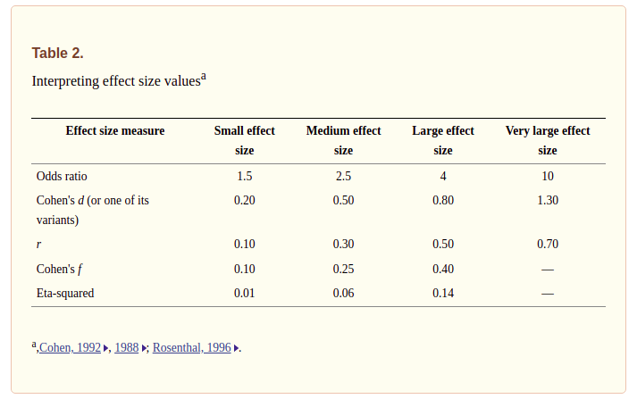

```{r echo=FALSE}
xaringanExtra::use_panelset()
```

class: inverse, center, middle

# Modelos Estadísticos
<html><div style='float:left'></div><hr color='#EB811B' size=1px width=720px></html> 

---

# Tipos de modelos

<br>

<center>

</center>

---

# Métodos estadísticos

<center>

</center>

| Tipo de análisis | Método Paramétrico | Método no Paramétrico |
| :--- | :----------------: | :----: |
| Comparar medias (1 o 2 grupos) | *t-Student* | *Wilcoxon* |
| Comparar medias (> 2 grupos) | *Anova*  | *Kruskal-Wallis* |


---

class: inverse, center, middle

# Diseño de Experimentos
<html><div style='float:left'></div><hr color='#EB811B' size=1px width=720px></html> 

<center>

</center>

---

# El arte de la experimentación

.panelset[

.panel[.panel-name[Principios]

.pull-left[ 

#### ¿Por qué hacer un experimento?

- Determinar las principales causas de variación en una respuesta medida
- Encontrar las condiciones que dan lugar a una respuesta máxima o mínima
- Obtener un modelo matemático para predecir respuestas futuras

#### Técnicas fundamentales

- Replicación `->`  Incrementa precisión
- Bloqueo `->` Incrementa precisión
- Aleatorización `->` Reduce el sesgo

]

.pull-right[

<br>

<center>

</center>


]


]

.panel[.panel-name[Conceptos]

- Réplica
- Repetición
- Unidad experimental
- Factor (fuente de variación)
- Tratamiento
- Bloque
- Efectos aditivos
- Efectos multiplicativos (interacción)

]

]

---

class: inverse, center, middle

# Análisis de Varianza
<html><div style='float:left'></div><hr color='#EB811B' size=1px width=720px></html> 

<center>

</center>

---

# Descripción del análisis de varianza

- Conjunto de modelos estadísticos usados para analizar diferencias de medias entre grupos en una muestra.
- Basado en la [ley de la varianza total](https://en.wikipedia.org/wiki/Law_of_total_variance), donde la varianza observada de una variable bajo análisis es particionada en componentes atribuibles a diferentes **fuentes de variación**.
- Permite generalizar la prueba *t-student* más allá de dos medias.
- La lógica general del análisis de varianza está fundamentada en la descomposición de la suma de cuadrados total en sumas de cuadrados entre (*tratamientos*) e intra (*error*) grupos:

$$SS_{Total} = SS_{Tratamientos} + SS_{Error}$$
- Visto como un función matemática podría expresarse de la siguiente forma:

$$y_{ij} = \mu + \tau_j + \epsilon_{ij}$$
Donde:
- $y_{ij}$: variable respuesta o dependiente
- $\mu$: media general (intercepto)
- $\tau_i$: efecto del $j-ésimo$ tratamiento
- $\epsilon_{ij}$: error aleatorio experimental, se debe garantizar que $\epsilon_{ij} \sim N(\mu=0,\sigma^2)$

---

# Supuestos del análisis de varianza

.pull-left[

Los residuales del modelo $(\epsilon)$ deben cumplir con:
- **Normalidad:** se puede verificar a través de histogramas, gráficos cuantil cuantil o con la prueba de *Shapiro-Wilk*.
- **Homocedasticidad:** se puede verificar a través valores ajustados (eje x) vs residuales (eje y) o con las pruebas de *Bartlett* o *Levene*. La primera es útil cuando la normalidad se cumple, de lo contrario es mejor usar la segunda.
- **Independencia**

- $\epsilon \sim N(\mu=0,\ \sigma^2)$

]

.pull-right[

- **Normalidad:**

```{r, echo=FALSE, fig.height=4}
set.seed(2021)
qqnorm(rnorm(100, 0, 1))
qqline(rnorm(100, 0, 1))
```

- **Homocedasticidad:**

```{r, echo = FALSE, fig.height=4}
modelo <- aov(iris$Sepal.Length ~ iris$Species)
ajustados <- fitted(modelo)
residuales <- residuals(modelo)
plot(ajustados, residuales)
abline(h = 0, col = "red")
```

]

---

# Homocedasticidad y heterocedasticidad

<center>

</center>

---

class: inverse, center, middle

# Pruebas *post-hoc*
<html><div style='float:left'></div><hr color='#EB811B' size=1px width=720px></html> 

<center>

</center>

---

# Comparaciones múltiples

- Probabilidad de al menos un falso positivo
  - Holm
  - Hochberg
  - Hommel
  - Bonferroni
- Proporción esperada de falsos positivos
  - Duncan
  - Tukey
  - Dunnet
  
### Comparaciones múltiples con R

```{r, eval=FALSE}
pairwise.t.test()
pairwise.wilcox.test()
TukeyHSD()
...
...
...
```

---

class: inverse, center, middle

# Tamaño del efecto `->` [Consultar artículo](https://www.ncbi.nlm.nih.gov/pmc/articles/PMC3763001/)
<html><div style='float:left'></div><hr color='#EB811B' size=1px width=720px></html> 

<center>

</center>

## [Significancia estadística vs Significancia práctica]()


---

# Interpretación y cálculo con R

<center>

</center>

```{r, eval=FALSE}
library(effectsize)
eta_squared()
cohens_f()
```

<br>

.footnote[
[1] [The Other Half of the Story: Effect Size Analysis in Quantitative Research](https://www.ncbi.nlm.nih.gov/pmc/articles/PMC3763001/)]

---
class: inverse, center, middle

# No olvidar que...

<html><div style='float:left'></div><hr color='#EB811B' size=1px width=720px></html> 

<center>

</center>

---
class: inverse, center, middle

# No cometer este error...

<html><div style='float:left'></div><hr color='#EB811B' size=1px width=720px></html> 

<center>

</center>


---
class: inverse, center, middle

# ¡Gracias!

<html><div style='float:left'></div><hr color='#EB811B' size=1px width=720px></html> 

<center>

</center>

